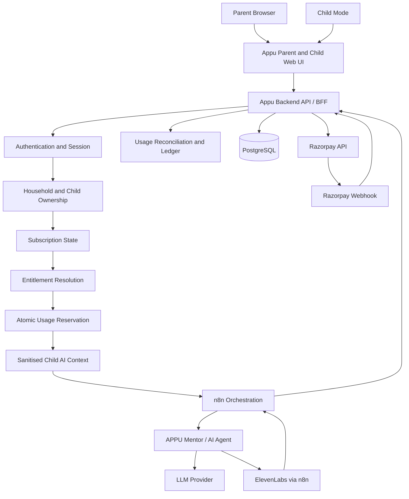

# Appu Phase 2 Architecture

Status: Proposed architecture for review
Last updated: 2026-08-20
Scope: SaaS, subscription, tenancy, personalisation, payment, usage, and security foundation

## Document authority

Repository code is the source of truth for checked-in application behaviour. The current live n8n workflow has been manually verified by the product owner and is authoritative for live workflow topology where it differs from the stale checked-in export.

Known documentation issue:

```text
LIVE_N8N_WORKFLOW_DRIFT:
The checked-in n8n snapshot is outdated compared with the production/live workflow.
A fresh sanitized export should replace it before it is used as architecture documentation.
```

The stale `scratch_workflow_raw.json` must not override the manually verified live architecture. It must not be edited as though it were the production workflow. Before changing n8n, obtain a fresh sanitised export, review it for secrets and personal data, and replace or archive the stale snapshot deliberately.

## 1. Current Phase 1 architecture

### Confirmed repository architecture

Appu Phase 1 is a static, framework-free web application:

- `index.html` provides the single-screen child experience, entrance video, chat drawer, Parent Zone, and settings dialog.
- `style.css` contains the responsive visual system.
- `app.js` orchestrates UI, chat, microphone, language, settings, and Parent Zone behaviour.
- `chat-agent.js` sends messages directly from the browser to a public n8n webhook.
- `voice-engine.js` uses browser speech recognition and plays audio returned by the workflow.
- `voice-contract.js` normalises n8n text and Base64/audio URL response formats.
- `avatar-stage.js` manages Appu's visual state.
- `deploy/` and `deploy-to-hostinger.zip` are static deployment artefacts.

There is currently no checked-in backend server, authentication system, database schema, migration framework, package manifest, or server-side secrets boundary.

### Confirmed current live Appu website flow

The product owner manually verified the current live n8n flow as approximately:

```text
Website Webhook
  -> Normalize Website Input
  -> Validate APPU Conversation Envelope
  -> APPU Mentor / AI Agent
  -> Restore APPU Response Context
  -> Is WhatsApp Channel
  -> Generate APPU Voice (ElevenLabs)
  -> Encode Audio to Base64
  -> Respond to Website Webhook
```

ElevenLabs is therefore confirmed in the current live n8n workflow. ElevenLabs runs through n8n, not through browser JavaScript. No ElevenLabs secret belongs in the browser.

### Current request and memory identity

The browser creates a short random `sessionId`, stores it in `localStorage`, and submits it to n8n. This is sufficient for a Phase 1 demo but is not an authenticated identity, tenant boundary, child identifier, or secure memory key.

### Current deployment

Phase 1 is packaged as static files for Hostinger `public_html`. Whether the current Hostinger account supports Node.js Web Apps is an unresolved deployment decision and must be confirmed before selecting the backend runtime location.

## 2. Proposed Phase 2 architecture

Phase 2 should add a trusted backend boundary without rewriting the existing child UI or the working n8n/ElevenLabs orchestration.

Recommended provisional stack:

- Existing static Appu child UI, progressively adapted to call the Appu API.
- Node.js, TypeScript, and Fastify for the backend API/BFF.
- PostgreSQL, with Supabase as the preferred managed option pending infrastructure confirmation.
- Supabase Auth or an equivalent managed identity provider for parent authentication.
- Razorpay Subscriptions and Standard Checkout in test mode first.
- Existing n8n workflow for AI and ElevenLabs orchestration.
- Server-side domain services for tenancy, subscriptions, entitlements, quota, payments, AI context, and audit logging.

The backend is the security authority. n8n remains the orchestration authority for AI and voice execution.

## 3. Architecture diagram



## 4. Parent and child tenancy model

Use a `household` as the tenant root rather than treating a browser session or child as the tenant.

```text
Household
  -> Parent members
  -> Subscription(s)
  -> Child profiles
       -> Explicit preferences
       -> Learning context
       -> Conversation sessions
       -> Usage
       -> Child access sessions
```

Rules:

- A parent may access only households where they have an active membership.
- A parent may access a child only when the child belongs to that household.
- A child workspace is always bound to one `household_id` and one `child_id`.
- Child A and Child B never share conversation or learning context merely because they share a household.
- Parent and child mode use different authorisation scopes.
- Child mode receives no billing, consent-management, or parent-account authority.
- Composite database constraints should bind child-owned records to the same household, preventing cross-tenant references even when application code is wrong.

## 5. Authentication model

There is no existing authentication to preserve. Introduce parent authentication as an additive Phase 2 service.

Preferred model:

- Managed parent identity through Supabase Auth is the preferred provider.
- The `household_members.user_id` UUID column is designed to reference the verified Supabase Auth user UUID (`auth.users.id`) when Supabase is confirmed.
- A hard foreign key across schemas (`REFERENCES auth.users(id)`) is deferred until deployment architecture guarantees both schemas exist within the same PostgreSQL instance.
- **Provider Subject Fallback**: If a non-UUID auth provider (e.g. Auth0, Clerk, or custom OAuth2) is selected instead, an internal `user_identities` mapping table (`id UUID PRIMARY KEY, provider_subject TEXT UNIQUE, ...`) will map arbitrary provider subject strings to internal UUIDs, ensuring `household_members.user_id` remains an invariant UUID.
- Same-origin, secure, `HttpOnly`, `Secure`, `SameSite` session cookies when the final hosting layout permits it.
- If frontend and backend must use separate origins, use short-lived access tokens, strict CORS, careful refresh-token handling, and explicit CSRF analysis.
- Parent sign-up, sign-in, sign-out, email verification, password reset, and session revocation are server-aware flows.
- A child does not initially receive an independent parent-equivalent account.
- Child mode starts through a short-lived, narrowly scoped `child_access_session` authorised by the parent and bound to one child.

Authentication establishes who is making the request. It does not by itself establish child ownership, subscription access, entitlement, or quota.


## 6. Authorization model

Protected requests pass a central policy sequence:

1. Verify authenticated parent or valid child-mode session.
2. Resolve the household from trusted server/session data.
3. Validate membership and role.
4. Resolve child ID from the route/session and verify household ownership.
5. Resolve effective subscription state.
6. Resolve effective entitlements.
7. Apply security rate limits.
8. Apply subscription quota limits.
9. Execute the permitted operation.

Do not trust browser-supplied:

- `parent_user_id`
- `household_id`
- `child_id` without ownership validation
- plan code or price
- subscription status
- entitlement values
- quota state
- Razorpay success claims
- AI context or voice entitlement claims

PostgreSQL row-level security is recommended as defence-in-depth, not as a replacement for service-level policy checks.

## 7. Proposed database schema

The following is a proposed relational model. Exact SQL belongs in reviewed migrations.

### Identity and tenancy

| Table | Purpose |
|---|---|
| `households` | Tenant root for a family account. |
| `household_members` | Connects authenticated users to households with roles. |
| `parent_profiles` | Minimal parent-facing profile data separate from auth credentials. |
| `child_profiles` | Nickname, age/grade band, status, avatar reference, and household ownership. |
| `child_access_sessions` | Short-lived child-mode sessions with limited scope. |

### Personalisation and learning

| Table | Purpose |
|---|---|
| `child_communication_preferences` | Languages, approved voice token, speed, explanation length, and tone tokens. |
| `child_learning_preferences` | Learning pace, explicit explanation style, difficulty policy, and storytelling preference. |
| `child_experience_preferences` | Approved theme, accent, font pack, card style, motion, density, and avatar IDs. |
| `child_interests` | Explicit parent/child-selected interests using controlled values. |
| `child_subject_preferences` | Favourite/challenging subjects and explicit preferences. |
| `learning_goals` | Parent/child-created goals with status and optional target date. |
| `learning_topic_progress` | Minimal educational progress/context per topic. |

### Conversation and memory

| Table | Purpose |
|---|---|
| `conversation_sessions` | A child-scoped Appu session. |
| `conversation_messages` | Permitted short/medium-term history with retention metadata. |
| `child_memory_facts` | Approved explicit or derived learning facts with source and confidence; not a generic memory blob. |

Explicit preferences, learning context, and conversation context remain separate so each can be reset or deleted independently.

### Plans, subscriptions, and entitlements

| Table | Purpose |
|---|---|
| `plans` | Stable plan code, name, status, and presentation metadata. |
| `plan_prices` | Currency, amount, billing interval, provider plan ID, and effective dates. |
| `entitlement_definitions` | Stable key, data type, unit, aggregation strategy, and description. |
| `plan_entitlements` | Default entitlement values for a plan. |
| `subscriptions` | Household subscription and internal state. |
| `subscription_entitlement_grants` | Effective plan snapshot, overrides, trials, promotions, add-ons, and grandfathering. |

Plan prices and entitlements are configuration/data, never scattered frontend conditions.

### Usage, payments, consent, and audit

| Table | Purpose |
|---|---|
| `usage_events` | Append-only successful/reconciled usage ledger. |
| `usage_reservations` | Pending quota reservations used to prevent concurrent overspend. |
| `payment_events` | Idempotent Razorpay webhook/event processing records. |
| `payment_provider_refs` | Minimal provider customer/subscription/payment identifiers. |
| `consent_records` | Versioned parent consent and revocation records. |
| `audit_logs` | Security and business transition audit events without sensitive payloads. |

Recommended constraints include:

- Unique active household membership per user/household.
- Unique `(household_id, child_id)` identity suitable for composite foreign keys.
- Unique `(provider, provider_event_id)` payment events.
- Unique usage idempotency key per billable request.
- Check constraints for subscription states and controlled preference tokens.
- Foreign keys with restrictive deletion by default; explicit deletion services handle child/account erasure.

## 8. Subscription model

Proposed internal states:

```text
DRAFT
  -> PENDING_PAYMENT
  -> AUTHENTICATED
  -> ACTIVE
  -> PAST_DUE
  -> HALTED
  -> PAUSED
  -> CANCELLED
  -> EXPIRED
```

Rules:

- `ACTIVE` grants normal paid entitlements.
- Trials use explicit time-bound grants, not a fake paid state.
- `AUTHENTICATED` means checkout/payment authentication was verified but final provider confirmation may still be pending.
- `PENDING_PAYMENT` and uncertain states do not grant permanent paid access.
- State transitions occur through one `SubscriptionService` and a validated transition table.
- Provider statuses/events map into internal states at the integration boundary.
- Out-of-order webhook events must be handled without invalid backwards transitions.

## 9. Entitlement model

Entitlements are centrally resolved by stable keys and typed values.

Examples:

```text
children.max_count                 integer
ai.monthly_sessions               integer
ai.monthly_requests               integer
voice.enabled                     boolean
voice.monthly_seconds             integer
languages.allowed                 string_set
personalisation.level             enum
reports.weekly                    boolean
context.long_term                 boolean
themes.premium                    boolean
```

Conceptual service interface:

```typescript
entitlements.resolve(subscriptionId, at)
entitlements.can(subscriptionId, "voice.enabled")
entitlements.getLimit(subscriptionId, "voice.monthly_seconds")
entitlements.canCreateChild(householdId)
```

Resolution order is explicit and auditable:

```text
plan defaults
  -> grandfathered subscription snapshot
  -> promotional/trial grants
  -> purchased add-ons
  -> administrative correction with audit record
```

Frontend entitlement information is presentational only. All expensive operations are checked server-side.

## 10. Usage model

`usage_events` is append-only and supports:

- AI request count
- AI session count
- input/output/total tokens when available
- voice input characters
- voice output characters
- voice seconds
- child, household, subscription, plan, billing period, request, and provider dimensions

Representative columns:

```text
id
household_id
subscription_id
child_id
request_id
idempotency_key
resource_type
quantity
unit
occurred_at
billing_period_start
billing_period_end
provider
safe_metadata
```

### Concurrency-safe quota flow

1. Begin a database transaction.
2. Lock the relevant subscription/quota bucket or invoke an atomic database function.
3. Sum settled usage plus active reservations for the billing period.
4. Reject if the requested reservation exceeds the entitlement.
5. Insert a reservation with expiry and idempotency key.
6. Commit before invoking n8n/provider services.
7. On success, reconcile the reservation to actual usage and append usage events.
8. On failure with no provider consumption, release/expire the reservation.
9. If partial provider consumption occurred, record only measurable consumed usage.

Security rate limits are separate from commercial quota limits.

## 11. Razorpay architecture

Use Razorpay Subscriptions and Standard Checkout in test mode first.

```text
Parent chooses plan code
  -> backend loads active server-side plan price
  -> backend creates/reuses Razorpay customer if required
  -> backend creates Razorpay subscription
  -> backend stores provider reference and PENDING_PAYMENT
  -> browser opens Standard Checkout using public key and server-created identifiers
  -> browser submits checkout result to backend verification endpoint
  -> backend verifies signature against server-owned identifiers
  -> UI shows processing/authenticated state
  -> signed webhook confirms provider lifecycle event
  -> idempotent state transition
  -> entitlement grants become effective
```

Secrets remain server-side:

```text
RAZORPAY_KEY_ID
RAZORPAY_KEY_SECRET
RAZORPAY_WEBHOOK_SECRET
```

Only the public key ID may be sent to checkout. The browser cannot choose an amount, currency, provider plan ID, or entitlement set.

## 12. Payment lifecycle

Checkout completion is evidence requiring verification, not final authority.

1. Parent selects a stable Appu plan code.
2. Backend resolves the current active `plan_price`.
3. Backend creates the provider subscription and internal pending record.
4. Browser completes Razorpay Standard Checkout.
5. Backend verifies the returned signature using server-owned provider identifiers.
6. Backend moves to `AUTHENTICATED` or leaves the subscription pending.
7. Razorpay webhook arrives independently.
8. Backend verifies the webhook signature using the raw request body.
9. Backend atomically claims the provider event ID.
10. Worker/service maps the event to an allowed internal transition.
11. Effective entitlements are provisioned or revoked in the same transaction where practical.
12. UI polls or refreshes subscription status and receives a safe processing/success/failure state.

## 13. Webhook architecture

Webhook requirements:

- Dedicated public HTTPS route.
- Raw request body preserved for signature verification.
- `X-Razorpay-Signature` validation before trusting JSON.
- Unique provider event ID for duplicate detection.
- Idempotent atomic claim before processing.
- Out-of-order event handling.
- Small synchronous verification/acceptance path.
- Retryable asynchronous processing where hosting supports a queue.
- Safe transition log and error classification.
- No secrets or full payment payload in logs.
- No card data stored.

If the initial hosting environment lacks a durable queue, use a database-backed event inbox with explicit processing status and a scheduled worker. Do not pretend an in-memory queue is durable.

## 14. Personalisation architecture

Personalisation uses controlled, versioned tokens and explicit educational preferences.

Domains:

- Identity context: nickname, age band, grade band.
- Communication: primary/secondary language, approved voice, speed, explanation length, communication/encouragement style.
- Learning: interests, subjects, goals, pace, difficulty policy, preferred examples, storytelling preference.
- Experience: theme, accent, font pack, card style, motion level, density, avatar.

The server validates tokens against active catalogues. The browser never stores or submits arbitrary CSS, fonts, HTML, provider voice IDs, or uncontrolled colour values.

Examples:

```json
{
  "theme_id": "space",
  "accent_color_id": "purple",
  "font_pack_id": "rounded",
  "card_style_id": "soft",
  "motion_level": "medium",
  "avatar_id": "appu_astronaut"
}
```

Onboarding is progressive. Pre-payment drafts contain minimal information and expire if abandoned. Detailed personalisation begins only after account/payment validation and required consent.

## 15. Child AI context architecture

`MentorContextBuilder` constructs a new minimal, sanitised context from tenant-scoped server data for every authenticated APPU message. Construction occurs only after bearer verification, household membership, child ownership, ACTIVE subscription, entitlement resolution, and AI quota reservation.

Example backend-to-n8n contract:

```json
{
  "action": "sendMessage",
  "channel": "website",
  "sessionId": "appu_child_<verified-child-id>",
  "chatInput": "fractions ardham cheppu",
  "message": "fractions ardham cheppu",
  "language": "te",
  "childId": "<verified-child-id>",
  "mentorContext": {
    "mode": "authenticated",
    "learnerId": "<verified-child-id>",
    "learnerName": "Aarav",
    "grade": "Grade 6",
    "primaryLanguage": "te",
    "learningStyle": "visual",
    "responseStyle": "playful",
    "favoriteSubjects": ["mathematics"],
    "interests": ["cricket", "space"],
    "learningGoals": ["understand fractions"],
    "personalizationEnabled": true,
    "advancedPersonalizationEnabled": true,
    "longTermContextEnabled": false
  }
}
```

Guests receive only `{ "mode": "guest", "primaryLanguage": "...", "personalizationEnabled": false }`. Do not send UI-only colors/fonts/themes, voice configuration, arbitrary `additionalContext`, parent/household data, billing/provider/payment state, authentication tokens, raw entitlement grants, or private security metadata to n8n/AI.

The backend owns the n8n session key. Recommended key structure uses non-guessable internal IDs and an environment/version namespace. A child's key never derives from a browser-controlled value.

## 16. n8n changes

n8n continues to orchestrate:

- Input normalisation at the workflow boundary.
- Appu AI agent execution.
- Model/tool calls.
- ElevenLabs generation.
- Audio Base64 encoding.
- Website/WhatsApp channel response shaping.

n8n must not decide:

- Authentication.
- Household membership.
- Child ownership.
- Subscription validity.
- Plan price.
- Entitlement availability.
- Remaining quota.
- Payment activation.

Required incremental changes after the backend adapter exists:

1. Add a server-to-server authentication mechanism for the website entry path.
2. Accept the versioned sanitised context contract.
3. Stop trusting browser-generated session IDs.
4. Return a stable response envelope including text, audio, and measurable usage metadata.
5. Preserve the existing ElevenLabs path until adapter tests pass.
6. Disable or isolate the direct public website webhook only after a verified cutover.

### Durable request lifecycle and signed reconciliation

`appu_requests` is separate from the append-only usage ledger and records one logical downstream invocation. Authenticated uniqueness is `(household_id, idempotency_key)`; guest uniqueness is `(guest_session_id, idempotency_key)`. The reservation and lifecycle row are created in one transaction under a PostgreSQL advisory transaction lock, with partial unique indexes as the cross-process authority.

```text
PENDING -> SUCCEEDED
PENDING -> DEFINITE_FAILURE
PENDING -> UNKNOWN -> SUCCEEDED
PENDING -> UNKNOWN -> DEFINITE_FAILURE
```

`UNKNOWN` means transport outcome is ambiguous, not failure. Its reservation is never released merely because a timeout or TTL elapsed. The n8n callback carries only request ID, terminal outcome, completion timestamp, optional execution ID, and a bounded failure code. It does not carry learner/billing/auth data or audio. Terminal reconciliation locks the lifecycle row and atomically commits/releases the linked usage record or guest turn. Duplicate terminal callbacks are no-ops; contradictory terminal outcomes are rejected.

Both directions use independent HMAC-SHA256 secrets and sign `timestamp + "." + exactRawBody`. n8n Webhook v2.1 raw-body mode retains the exact bytes as binary data. The verifier must run before Normalize/Validate accepts MentorContext. Production startup fails closed if the APPU webhook is configured without both secrets.
7. Replace the stale repository snapshot with a fresh sanitised export.

As of 2026-08-24, the backend adapter emits the canonical `mentorContext` property and has differential/isolation/update tests. The live n8n workflow has not been changed. Apply the exact manual node changes in `docs/N8N_MENTOR_CONTEXT_RUNBOOK.md` to `Normalize Website Input`, `Validate APPU Conversation Envelope`, and `APPU Mentor`. The APPU Mentor change is append-only and preserves the complete existing production master prompt and WhatsApp profile path.

## 17. Voice and ElevenLabs flow

Current confirmed live behaviour:

```text
Browser message
  -> n8n
  -> APPU Mentor
  -> ElevenLabs in n8n
  -> Base64 audio
  -> browser VoiceEngine playback
```

Target Phase 2 behaviour:

```text
Browser message
  -> Appu Backend
  -> authenticate and verify child ownership
  -> verify subscription and voice entitlement
  -> atomically reserve voice quota
  -> build sanitised context
  -> n8n
  -> APPU Mentor
  -> ElevenLabs in n8n
  -> Base64 audio plus usage metadata
  -> backend reconciles actual voice usage
  -> browser VoiceEngine playback
```

The initial adapter must retain the existing `voice-contract.js` response compatibility. ElevenLabs credentials remain in n8n or another server-side secret store, never in browser code.

Usage metadata should include the best available actual unit, such as characters and/or generated audio seconds. If ElevenLabs/n8n cannot return authoritative usage yet, reserve by bounded input size and document the temporary estimation method; do not label estimates as actual usage.

## 18. Parent dashboard architecture

Parent mode is a separate authorised experience containing:

- Account profile and security settings.
- Current subscription, status, billing period, renewal, and safe management actions.
- Child list and per-child personalisation.
- AI/voice usage and reset date.
- Consent and privacy controls.
- Conversation deletion, learning reset, personalisation reset, child deletion, and account deletion requests.
- Entitled reports and progress summaries.

Child mode contains Appu conversations, learning activities, voice, and personalised visuals. It never exposes billing controls, payment identifiers, parent contact data, or sibling context.

## 19. Security model

Minimum controls:

- Central authentication and authorisation middleware.
- Household/child ownership verification on every child route.
- PostgreSQL RLS and composite tenant constraints as defence-in-depth.
- Server-side entitlement and quota checks.
- CSRF protection appropriate to final cookie/origin architecture.
- Strict CORS, HTTPS, secure cookies, session rotation, and logout revocation.
- Zod or equivalent request/response validation.
- Parameterised database access and migrations.
- Security rate limits separate from product quota.
- Raw-body Razorpay webhook signature verification.
- Idempotency keys and replay protection.
- Provider timeouts, circuit breaking, and bounded retries.
- URL protocol allowlists for provider-returned links.
- CSP and security headers for the web application.
- No provider secret, service-role key, or internal stack trace in browser responses.
- Dependency and secret scanning in CI.

## 20. Privacy and data considerations for children

Appu should minimise child data by default:

- Prefer nickname and grade band over legal name, birth date, school, or precise location.
- Store only explicit preferences and educational context needed for the product.
- Avoid psychological labels and behavioural surveillance.
- Record source and confidence for derived learning facts.
- Make conversation deletion, learning reset, personalisation reset, child deletion, and household deletion separate operations.
- Apply configurable retention periods to drafts, conversations, provider logs, and audit records.
- Keep parent payment/contact information out of AI context.
- Store consent type, version, acceptance time, revocation time, and scope.

Final consent text, age thresholds, retention periods, child privacy compliance, tax, invoice, cancellation, refund, and recurring-payment policy require human legal/privacy review. This architecture does not make compliance claims.

## 21. Error-handling strategy

Use stable public error codes and safe messages:

```text
unauthorized
forbidden
invalid_child
subscription_required
subscription_inactive
payment_processing
payment_failed
quota_exceeded
voice_quota_exceeded
rate_limited
invalid_request
service_temporarily_unavailable
```

Provider errors map to internal typed errors. Browser responses never expose stack traces, secrets, raw n8n output, Razorpay payloads, or ElevenLabs errors.

Fail-safe rules:

- Uncertain payment state does not grant permanent access.
- AI/voice failures do not settle unused quota.
- Partial provider usage is recorded only when measurable.
- Booking/payment UI never displays success after a failed/unverified request.

## 22. Logging and observability

Use structured logs with request IDs and safe identifiers for:

- Authentication failures.
- Ownership denials.
- Entitlement/quota denials.
- Subscription transitions.
- Razorpay webhook verification and processing status.
- n8n/LLM/ElevenLabs availability and latency.
- Usage reservation/reconciliation failures.
- Consent and deletion operations.

Do not log:

- Authentication tokens or cookies.
- Provider secrets or signatures.
- Full child profiles.
- Unnecessary conversation content.
- Payment payloads or card data.
- Parent phone/email unless strictly required and appropriately redacted.

Foundation metrics should support requests, sessions, tokens, voice usage, latency, failures, and cost attribution by plan without building a surveillance platform.

## 23. Testing plan

### Existing baseline

Phase 1 currently has structural and voice-contract tests. Preserve them throughout the migration.

### Unit tests

- Subscription transition table.
- Entitlement merging and typed values.
- Child ownership policies.
- Controlled personalisation validation.
- Usage aggregation and reservation decisions.
- AI context sanitisation.
- Provider error mapping.

### Integration tests

- Create/list/update child under the authenticated household.
- Deny Parent A access to Parent B's child.
- Enforce maximum child count.
- Resolve plan and promotional entitlement grants.
- Atomic quota reservation under concurrent requests.
- Create Razorpay test subscription with server-selected pricing.
- Verify checkout signature using server-owned identifiers.
- Verify, claim, replay, duplicate, and process webhook events.
- Construct n8n request context without parent/payment data.
- Reconcile voice usage metadata.

### Failure/security tests

- Manipulated household, child, plan, price, entitlement, and payment IDs.
- Forged checkout success and invalid signatures.
- Duplicate and out-of-order webhooks.
- Expired/cancelled/paused subscriptions.
- Concurrent last-unit quota requests.
- n8n, ElevenLabs, LLM, database, and Razorpay timeouts.
- XSS payloads in messages/provider links.
- CSRF and rate-limit behaviour for the selected deployment model.

### End-to-end tests

Use Razorpay test mode for parent sign-up, plan selection, child preview, consent, checkout, webhook activation, detailed personalisation, child-mode entry, Appu chat/voice, usage display, and subscription management.

## 24. Migration strategy

Migration is additive and reversible by milestone:

1. Preserve the current static deployment and public n8n flow as the Phase 1 baseline.
2. Add backend/domain code without changing Phase 1 routing.
3. Add PostgreSQL migrations; never mutate production schema manually.
4. Add parent accounts and child profiles behind feature flags/test environments.
5. Add an n8n adapter that can be tested without disabling the public path.
6. Shadow/test context construction and response normalisation.
7. Cut browser chat to `/api/appu/chat` only after integration and failure-path tests pass.
8. Disable public browser-to-n8n access after verified cutover and rollback preparation.
9. Migrate any approved Phase 1 preferences only with explicit mapping; do not treat `localStorage` session IDs as accounts.

Every migration documents forward action, data impact, validation query, and rollback/compensating action. No Phase 1 data is deleted without explicit approval.

## 25. Implementation milestones

### Milestone 0 — Documentation and verified baselines

- Architecture/context/task documents.
- Fresh sanitised live n8n export.
- Hosting/runtime decision.
- Current Phase 1 regression baseline.

### Milestone 1 — Backend/domain foundation

- TypeScript/Fastify project.
- Environment validation and `.env.example`.
- Health endpoint and structured error contract.
- Subscription state machine and entitlement value types with unit tests.
- No Phase 1 request-path change.

### Milestone 2 — Authentication and household tenancy

- Parent identity, secure sessions, households, membership, and RLS.

### Milestone 3 — Child profiles and isolation

- Child CRUD, ownership policies, child-mode sessions, and adversarial isolation tests.

### Milestone 4 — Personalisation engine

- Controlled token catalogues, progressive onboarding, preview, and reset semantics.

### Milestone 5 — Plans and entitlement engine

- Configurable plans/prices, typed entitlements, snapshots, promotions, and future add-on grants.

### Milestone 6 — Usage ledger and quotas

- Append-only ledger, reservations, atomic limit enforcement, and usage summaries.

### Milestone 7 — Razorpay test-mode integration

- Server-created subscriptions, Standard Checkout, callback verification, and processing UI.

### Milestone 8 — Webhook and state-machine security

- Raw signature validation, idempotent inbox, retries, out-of-order events, and safe transitions.

### Milestone 9 — n8n personalised context adapter

- Backend-authorised chat, server-owned sessions, sanitised context, and public-path cutover plan.

### Milestone 10 — Voice entitlement and usage

- Preserve ElevenLabs in n8n, measure/reconcile usage, and enforce voice limits.

### Milestone 11 — Parent dashboard

- Subscription, children, personalisation, usage, consent, privacy, and reports.

### Milestone 12 — Security and privacy hardening

- Headers, CSRF/CORS, deletion/retention, audit, rate limits, dependency scanning, and operational runbooks.

### Milestone 13 — End-to-end and production readiness

- Full test-mode lifecycle, load/concurrency tests, backup/restore, observability, and explicit go-live review.

## 26. Assumptions

- The existing Phase 1 UI and browser voice playback remain functional and must be preserved.
- The product owner's manually verified live n8n topology is accurate as of 2026-08-20.
- ElevenLabs credentials are currently held inside n8n/server-side configuration, not browser JavaScript.
- The live n8n workflow can eventually be called server-to-server.
- A production-grade PostgreSQL service can be provisioned.
- Razorpay recurring subscriptions will be developed and tested only in test mode until explicit go-live approval.
- Pricing, quotas, legal wording, and retention periods remain configurable decisions.

## 27. Open risks and questions

1. Does the current Hostinger account support Node.js Web Apps, or only static `public_html` hosting?
2. Will the API be same-origin with the frontend or use an `api` subdomain?
3. Which parent authentication method is preferred: email/password, email OTP, phone OTP, or a staged combination?
4. Obtain a fresh sanitised live n8n export and document the exact website webhook contract.
5. What measurable ElevenLabs usage fields can the live workflow return reliably?
6. Can the public n8n website webhook be restricted or disabled after backend cutover without affecting WhatsApp?
7. Which Indian recurring-payment methods and Razorpay subscription behaviours are enabled on the merchant account?
8. What trial length, plan prices, quotas, cancellation policy, refunds, taxes, and invoice requirements are approved?
9. What consent text, policy versions, data retention, deletion SLA, and child age rules receive legal/privacy approval?
10. What background-job mechanism is available in the selected hosting environment?

Until these are resolved, the architecture remains deliberately provider/configuration driven and no live payment activation is authorised.
