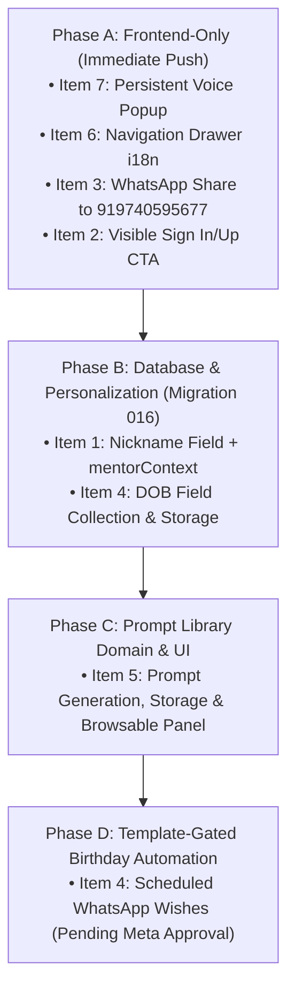

# APPU System Enhancements Design Specification (Phased)

**Date:** 2026-09-08  
**Status:** Draft design for coordinator review  
**Scope:** 7 Authoritative User Decisions across 4 Delivery Phases  

---

## 1. Executive Summary & Authoritative Decisions

This specification outlines the technical design for a batch of 7 enhancements to APPU across web and mobile surfaces. All decisions are authoritative and aligned with our kid-first, high-trust luxury educational principles.

### Authoritative User Decisions
1. **Personalization Nickname:** Add a `nickname` field to child personalization. Plumb `nickname` into the backend `mentorContext` so APPU addresses the child directly by their nickname in all conversational turns.
2. **Visible Sign in / Sign up CTA:** Add an explicit, visible "Sign in / Sign up" action on the main page (visible after skipping the welcome gate and on web landing), removing reliance on users discovering "Parent Setup" to authenticate.
3. **WhatsApp Study Note Share to Fixed Number:** Change the target of the in-chat "Send note to WhatsApp" button from dynamic parent phone to the fixed companion number **`919740595677`** (`+91 97405 95677`), pre-filling the note via `https://wa.me/919740595677?text=...`. Remove the consent-gate for this button (it represents a student-initiated send to APPU's verified WhatsApp companion line). Preserve note sanitization, the strict 500-character budget, and zero image bytes. Retain `parent_phone` and `whatsapp_consent` in household tenancy for parent notifications and proactive server-side sends.
4. **DOB Collection & Storage (+ Phased Birthday Wishes):** Collect Date of Birth (DOB) at personalization and store it in the database immediately. The automated birthday wish is text-only initially (song later), delivered via proactive WhatsApp, and **strictly gated on Meta template approval** (currently pending). DOB collection ships now; the proactive delivery mechanism is outlined for Phase D.
5. **Personalized Prompt Library:** A stored, browsable panel of prompts tailored to each learner's profile (grade band, favorite subjects, interests, goals). The child can open the panel, browse by category, and pick a prompt to converse with Appu.
6. **Left-Side Drawer Menu i18n (Bug Fix):** Wire all navigation drawer elements, actions, and legal links into `applyUiTranslations(lang)` and the `UI_TRANSLATIONS` dictionaries (`en`, `kn`, `hi`) so changing language translates the entire drawer in sync with the rest of the application.
7. **Persistent Voice Response Popup:** When using voice interaction without opening the chat drawer, the assistant's reply must persist in a dedicated popup until the NEXT response arrives, with a minimum display duration of 30 seconds. It must not vanish when the user begins speaking or when speech recognition restarts.

---

## 2. Delivery Phasing



- **Phase A (Frontend-Only, deploy = push):** Items 7 (Voice Popup), 6 (Menu i18n), 3 (Fixed WhatsApp Note Share), and 2 (Visible Sign in/up CTA). Zero backend migrations, zero backend code changes.
- **Phase B (Backend + Migration 016 + Personalization UI):** Item 1 (`nickname`) + Item 4 (`dob` collection & storage) + plumbing `nickname` into `mentorContext`.
- **Phase C (Backend Domain + LLM Generation + Browse UI):** Item 5 (Personalized Prompt Library architecture, storage, and browsable panel).
- **Phase D (Meta-Template Gated, Outline Only):** Item 4 (Proactive Birthday Wishes via WhatsApp scheduled job).

---

## 3. Detailed Technical Architecture

### 3.1 Item 7: Persistent Voice Response Popup (Phase A)

#### Problem Statement
In voice-only interactions (with `#chat-drawer` closed), Appu's audio response is mirrored into `#subtitles-text`. However:
1. When audio completes, `voice-engine.js` restarts listening in live session mode.
2. `recognition.onstart` immediately invokes `this.streamSubtitles('Listening — tell me what you want to learn.')`.
3. If the learner speaks, interim transcripts (`onInterimTranscript`) and user queries immediately overwrite `#subtitles-text`.
4. Consequently, Appu's answer vanishes within 350ms to a few seconds, preventing the child from reading or reflecting on the explanation unless they manually open the chat drawer.

#### Solution Architecture
Introduce a dedicated persistent popup component (`#voice-reply-popup`) detached from ephemeral listening status:
- **DOM Structure:** Placed above `.response-dock` inside `#app-shell`.
  ```html
  <div id="voice-reply-popup" class="voice-reply-popup" role="region" aria-live="polite" hidden>
    <div class="voice-popup-header">
      <div class="voice-popup-title">
        <span class="online-dot" aria-hidden="true"></span>
        <strong id="voice-popup-title-text">Appu says</strong>
      </div>
      <button id="btn-close-voice-popup" class="icon-btn voice-popup-close" type="button" aria-label="Dismiss response">
        <i class="fa-solid fa-xmark" aria-hidden="true"></i>
      </button>
    </div>
    <div id="voice-popup-content" class="voice-popup-body"></div>
  </div>
  ```
- **Lifecycle & Persistence Rules:**
  1. **Activation:** Whenever `chatAgent.sendMessage` receives an assistant reply while `#chat-drawer` is not open, the reply text is rendered into `#voice-popup-content` and `#voice-reply-popup` becomes visible.
  2. **Non-Interference:** Speech recognition events (`onstart`, `onInterimTranscript`, user queries) update the subtitle equalizer and a compact status line inside `.response-card`, but **never** overwrite or hide `#voice-reply-popup`.
  3. **Duration:**
     - Enforces a minimum lifespan of **30 seconds**.
     - Persists indefinitely until either:
       - The **next** assistant response arrives (which smoothly transitions the content and resets the 30s timer).
       - The learner taps the dismiss button (`#btn-close-voice-popup`).
       - The learner opens the full chat drawer (`#btn-toggle-chat`), where the conversation history takes precedence.
- **Visual Design:** Frosted glassmorphism (`backdrop-filter: blur(16px)`), subtle cyan border glow, dark luxury theme, responsive mobile positioning above dock controls.

---

### 3.2 Item 6: Left-Side Drawer Menu i18n (Phase A)

#### Problem Statement
`applyUiTranslations(lang)` in `frontend/app.js` translates landing cards, buttons, chat titles, modals, and settings, but completely ignores `#nav-drawer`. Elements in `#nav-drawer` remain hardcoded in English even when the user switches to Kannada or Hindi.

#### Solution Architecture
1. **Extend `UI_TRANSLATIONS` in `frontend/app.js`:**
   Add dictionary keys across `en`, `kn`, and `hi`:
   ```javascript
   // Common drawer dictionary keys:
   drawerLearnWithAppu: 'Learn with Appu', // kn: 'ಅಪ್ಪುವಿನೊಂದಿಗೆ ಕಲಿಯಿರಿ', hi: 'अप्पू के साथ सीखें'
   drawerCloseMenu: 'Close menu',         // kn: 'ಮೆನು ಮುಚ್ಚಿ', hi: 'मेनू बंद करें'
   drawerScheduleCall: 'Schedule Support Call', // kn: 'ಬೆಂಬಲ ಕರೆಯನ್ನು ನಿಗದಿಪಡಿಸಿ', hi: 'सपोर्ट कॉल शेड्यूल करें'
   drawerSoundEffects: 'Sound Effects',   // kn: 'ಧ್ವನಿ ಪರಿಣಾಮಗಳು', hi: 'ध्वनि प्रभाव'
   drawerPrivacy: 'Privacy Policy',       // kn: 'ಗೌಪ್ಯತಾ ನೀತಿ', hi: 'गोपनीयता नीति'
   drawerTerms: 'Terms & Conditions',     // kn: 'ನಿಯಮಗಳು ಮತ್ತು ಷರತ್ತುಗಳು', hi: 'नियम और शर्तें'
   drawerCancellation: 'Cancellation & Refunds', // kn: 'ರದ್ದತಿ ಮತ್ತು ಮರುಪಾವತಿ', hi: 'रद्दीकरण और धनवापसी'
   drawerShipping: 'Shipping & Delivery', // kn: 'ರವಾನೆ ಮತ್ತು ವಿತರಣೆ', hi: 'शिपिंग और डिलीवरी'
   drawerPricing: 'Pricing',             // kn: 'ಬೆಲೆ ವಿವರ', hi: 'मूल्य निर्धारण'
   drawerContact: 'Contact Us'           // kn: 'ನಮ್ಮನ್ನು ಸಂಪರ್ಕಿಸಿ', hi: 'संपर्क करें'
   ```
2. **Update `applyUiTranslations(lang)`:**
   Apply translations to:
   - `#nav-drawer-title small`: `t.drawerLearnWithAppu`
   - `#btn-close-nav-drawer`: `setAttribute('aria-label', t.drawerCloseMenu)`
   - `#btn-quick-schedule span` & attributes: `t.drawerScheduleCall`
   - `#btn-sound-toggle span` & attributes: `t.drawerSoundEffects`
   - `.nav-drawer-legal a[href*="privacy-policy"]`: `t.drawerPrivacy`
   - `.nav-drawer-legal a[href*="terms-and-conditions"]`: `t.drawerTerms`
   - `.nav-drawer-legal a[href*="cancellation-refund-policy"]`: `t.drawerCancellation`
   - `.nav-drawer-legal a[href*="shipping-delivery-policy"]`: `t.drawerShipping`
   - `.nav-drawer-legal a[href*="pricing"]`: `t.drawerPricing`
   - `.nav-drawer-legal a[href*="contact-us"]`: `t.drawerContact`

---

### 3.3 Item 3: WhatsApp Study Note Share to Fixed Number (Phase A)

#### Problem Statement
The current study note share affordance (`frontend/chat-agent.js` lines 79-138) targets the parent's personal phone number, is gated behind `whatsappConsent`, and falls back to opening Parent Zone setup if consent or phone is missing. The user decision mandates routing this action directly to APPU's verified fixed line (`+91 97405 95677`) so learners can share their notes with APPU's study line without parent consent gating.

#### Solution Architecture
- **Fixed Companion Number:** `const APPU_WHATSAPP_NUMBER = '919740595677';`
- **Frontend Changes:**
  - `frontend/appu-backend-client.js`:
    ```javascript
    function buildWhatsAppShareUrl(targetPhone = '919740595677', text, childName = '') {
      const recipient = (typeof targetPhone === 'string' && targetPhone.trim())
        ? targetPhone.replace(/\D/g, '')
        : '919740595677';
      const formattedNote = formatWhatsAppStudyNote(text, childName);
      if (!formattedNote) return null;
      return `https://wa.me/${recipient}?text=${encodeURIComponent(formattedNote)}`;
    }
    ```
  - `frontend/chat-agent.js`:
    - Remove the consent check, parent phone check, and modal 4 fallback for the note sharing button.
    - Clicking `.btn-share-whatsapp` constructs the URL targeting `919740595677` and calls `window.open(url, '_blank')`.
    - Update button text and labels:
      - Title: `"Share this study note with APPU on WhatsApp"`
      - Label / Inner Span: `<span>Send note to WhatsApp</span>`
    - Retain existing sanitization (`formatWhatsAppStudyNote`), 500-character cap, and zero image payload forwarding.
    - `parent_phone` and `whatsapp_consent` in household tenancy remain unaltered for parent notifications and proactive server sends.

---

### 3.4 Item 2: Visible Sign In / Sign Up CTA on Main Page (Phase A)

#### Problem Statement
On both web and native platforms, if a user skips the initial welcome gate (`#btn-welcome-skip`) or visits the web landing page unauthenticated, the only topbar button visible is "Parent Setup". There is no clear, standard "Sign in" or "Sign up" button on the main stage or header, making authentication unintuitive.

#### Solution Architecture
- **DOM Placement:**
  Add `#btn-main-auth` inside `.topbar-actions` (adjacent to `#btn-parent-setup` and `#parent-session-badge`) and `#nav-drawer-main-auth` inside the native navigation drawer.
  ```html
  <button id="btn-main-auth" class="auth-pill-btn" type="button">
    <i class="fa-solid fa-arrow-right-to-bracket" aria-hidden="true"></i>
    <span>Sign in / Sign up</span>
  </button>
  ```
- **State Behavior:**
  - **Unauthenticated:** `#btn-main-auth` is visible (`display: inline-flex`). Clicking it directly calls `window.ParentSetupUI.openModal(1)` (Auth Step 1: Login / Sign Up).
  - **Authenticated:** When `window.AppuSession.isAuthenticated()` is true, `#btn-main-auth` is hidden (`display: none`), and `#parent-session-badge` renders with the active child's name and logout affordance.
  - **Relocation in Native Mode:** In native mode (`isNativePlatform()`), `#btn-main-auth` is placed in `#nav-drawer-account-slot` alongside `#btn-parent-setup`.

---

### 3.5 Item 1: Learner Nickname & Mentor Context (Phase B)

#### Data Model (Migration 016)
```sql
-- Migration: 016_child_nickname_and_dob.sql
ALTER TABLE child_profiles
  ADD COLUMN IF NOT EXISTS nickname VARCHAR(50) NULL,
  ADD COLUMN IF NOT EXISTS dob DATE NULL;

COMMENT ON COLUMN child_profiles.nickname IS 'Preferred informal name for APPU conversational addressing';
COMMENT ON COLUMN child_profiles.dob IS 'Child date of birth for age-adapted pedagogy and birthday wishes';
```

#### Mentor Context Plumbing
In `backend/src/domain/personalisation/mentor-context-builder.ts`:
- Read `child.nickname`.
- If present, set `preferredAddressingName = child.nickname`.
- Inject into mentor instruction: `"The learner prefers to be called ${child.nickname}. Always address the learner by this nickname."`

#### UI Changes
In `frontend/parent-setup-ui.js` & `index.html` (Step 4 Personalization):
- Add `#pos-child-nickname` input with validation (1-50 chars, alphanumeric/spaces, sanitized).

---

### 3.6 Item 4: Date of Birth (DOB) Collection & Proactive Wishes (Phase B & D)

#### Collection (Phase B)
- In Step 4 Personalization form, add `#pos-child-dob` (`<input type="date">`).
- Validation: Date must be valid, not in the future, and represent a child between 3 and 25 years old.
- Persist in `child_profiles.dob` via `TenancyRepository.updateChildProfile`.

#### Birthday Wishes via WhatsApp (Phase D - Outlined Only)
- **Gating:** Blocked on Meta template approval (`appu_birthday_greeting_v1`).
- **Trigger:** Daily cron schedule running at 08:00 IST.
- **Recipient:** Evaluated against `households.parent_phone` where `whatsapp_consent = TRUE`.
- **Content:**
  - Milestone 1: Text-only greeting with child's nickname and encouraging celebratory note.
  - Milestone 2: Audio birthday song generated via approved media template.

---

### 3.7 Item 5: Personalized Prompt Library (Phase C)

#### Architectural Proposal
- **Generation Strategy:** Hybrid On-Save + On-Demand.
  - **On-Save (Background):** When child personalization is saved, a lightweight LLM task generates 12-16 tailored prompts categorized into 4 buckets:
    1. *Quick Concepts* (e.g. "Why is the sky blue?")
    2. *Homework Hints* (e.g. "Help me solve a quadratic equation step by step")
    3. *Curious Mind* (e.g. "Could humans live on Mars?")
    4. *Exam Drills* (e.g. "Quiz me on 10th grade physics optics")
  - **On-Demand:** Child can tap a "Refresh Prompts" button in the library to fetch fresh ideas.
- **Storage Strategy Options:**
  - *Option A (Dedicated Table - Recommended):* `child_prompts` table with columns `id`, `household_id`, `child_id`, `category`, `prompt_text`, `icon`, `created_at`. Supports independent updates, favorites, and pagination.
  - *Option B (JSONB Column):* `prompt_library` column in `child_personalisation`. Simpler schema, but harder to query or append individually.
- **Browse & Pick UI:**
  - Floating action pill or card on the main stage: "Explore Prompts".
  - Opens a responsive sliding sheet displaying category tabs.
  - Tapping any prompt card copies/sends the text into the active chat session.

---

## 4. Security & Compliance Invariants

1. **COPPA / Minor Privacy:** Date of Birth is stored strictly to adapt pedagogy and schedule parent-consented birthday greetings. It is never exposed in public responses or shared with third parties.
2. **Fixed WhatsApp Routing:** Directing note shares to `919740595677` ensures no user or child data is leaked to random phone numbers. The note is pre-filled in the learner's own WhatsApp client; the learner explicitly confirms the transmission.
3. **No Image Bytes in WhatsApp:** The study note formatter strictly excludes binary image payloads and base64 strings, enforcing text-only summaries.
4. **Zero Cache Leakage:** Nickname and DOB edits follow the established in-memory session bridge and are never cached in unencrypted `localStorage`.

---

## 5. Summary Matrix & Review Checklist

| Item | Description | Phase | Database Changes | Frontend Changes | Status |
| :--- | :--- | :---: | :---: | :---: | :---: |
| **7** | Persistent Voice Popup | **A** | None | `index.html`, `app.js`, `style.css` | Ready for Plan |
| **6** | Left-Side Drawer Menu i18n | **A** | None | `app.js` (`UI_TRANSLATIONS`) | Ready for Plan |
| **3** | WhatsApp Share to Fixed `919740595677` | **A** | None | `chat-agent.js`, `appu-backend-client.js` | Ready for Plan |
| **2** | Visible Sign In / Sign Up CTA | **A** | None | `index.html`, `app.js`, `parent-onboarding-shell.js` | Ready for Plan |
| **1** | Nickname & Mentor Context | **B** | Migration 016 | `parent-setup-ui.js`, `mentor-context-builder.ts` | Phased for B |
| **4** | DOB Collection & Storage | **B** | Migration 016 | `parent-setup-ui.js`, `repository.ts` | Phased for B |
| **5** | Personalized Prompt Library | **C** | Migration 017 | Dedicated prompt modal & LLM generator | Phased for C |
| **4b**| Proactive Birthday Sends | **D** | None (n8n/cron) | Scheduled Meta WhatsApp worker | Gated on Meta |
