# APPU Proactive WhatsApp Sends Design Specification

Date: 2026-09-08  
Status: Draft design for coordinator review  
Scope: Phase 2 Parent Automations + Phase D Birthday Wishes (Cron-Based Proactive Sends)

---

## 1. Executive Summary & Authoritative Principles

This specification designs the **Proactive WhatsApp Sends** subsystem for APPU, transitioning automated parent communication from isolated placeholders into a production-grade, server-verified, and privacy-first system.

### Scope & Active Templates
Four Meta message templates define the proactive communication surface (see [`docs/whatsapp-templates.md`](file:///D:/office/Appu-landing-page/docs/whatsapp-templates.md)):

| Template Name | Meta Status | Category | Variables | Schedule / Trigger |
| :--- | :--- | :--- | :--- | :--- |
| **`appu_weekly_digest`** | **APPROVED / Active** | Utility | `{{1}}` child name, `{{2}}` summary, `{{3}}` focus | Sundays at 6:00 PM IST |
| **`appu_daily_tip`** | **In Review** | Marketing | `{{1}}` child name, `{{2}}` tip | Daily at 8:30 AM IST |
| **`appu_birthday_wish`** | **In Review** | Marketing | `{{1}}` child name | Daily at 9:00 AM IST (DOB = today) |
| **`appu_study_reminder`**| **In Review** | Utility | `{{1}}` child name, `{{2}}` topic, `{{3}}` time | **DEFERRED** (Calendar sub-phase) |

### Authoritative Invariants
1. **Consent & Phone Gating:** Proactive messages are dispatched **strictly** to households where `whatsapp_consent = TRUE` and `parent_phone IS NOT NULL` (stored in `households` via Migration 015). If consent is absent, revoked, or the phone number is missing, the household is omitted.
2. **Zero `$fromAI` Hallucination:** Inbound AI models must **never** be responsible for providing recipient phone numbers or determining out-of-band template parameters. All recipient phone numbers, child names, learning metrics, and template variables are derived deterministically from verified server state.
3. **External Meta Template Gating:** While `appu_weekly_digest` is approved and ready for live dispatch, `appu_daily_tip` and `appu_birthday_wish` remain in Meta review. Backend generation and API routes can be fully deployed and tested immediately; live delivery in n8n for in-review templates is gated on Meta approval confirmation.
4. **Single Child per Household Invariant:** Matching existing system design, the parent's phone maps to a single household and its active child (`child_profiles.status = 'ACTIVE'`).
5. **No New Database Migrations Required:** All necessary tables and columns (`households.parent_phone`, `households.whatsapp_consent`, `child_profiles.nickname`, `child_profiles.dob`, `child_personalisation`, `conversation_sessions`, `conversation_messages`) already exist in production through Migrations 001–017.

---

## 2. Audit Findings & Baseline Analysis

### A. Existing n8n Upstream Workflow (`drr7AUOcj1VrU0j8`)

An audit of the production n8n workflow reveals the current state of proactive and template-related nodes:

1. **`Sunday 6:00 PM Parent Digest Cron` (`n8n-nodes-base.scheduleTrigger v1.2`)**:
   - Parameter: `rule.interval[0].expression = "0 18 * * 0"`.
   - Output connects to `Prepare Parent Digest`.
2. **`Prepare Parent Digest` (`n8n-nodes-base.code v2`)**:
   - Contains a hardcoded mock prompt: `"Create the requested IGr weekly parent progress digest using the learner data supplied..."`.
   - Hardcodes fallback recipient `"919740595677"`.
   - **Critical Gap:** Its output is completely **disconnected** (dangling node). It does not query any database or backend service.
3. **`Schedule Trigger` (`n8n-nodes-base.scheduleTrigger v1.3`)**:
   - Parameter: `triggerAtHour: 8`, `triggerAtMinute: 30` (Daily 8:30 AM).
   - Output connects to `Prepare Daily Morning Tip`.
4. **`Prepare Daily Morning Tip` (`n8n-nodes-base.code v2`)**:
   - Contains a hardcoded mock prompt: `"Create today's short Appu morning learning mission for CBSE learners..."`.
   - Hardcodes fallback recipient `"919740595677"`.
   - **Critical Gap:** Its output is completely **disconnected** (dangling node).
5. **`Send WhatsApp Template` (`n8n-nodes-base.whatsAppTool v1.1`)**:
   - Configured as an `ai_tool` connected to the `APPU Mentor` LangChain agent.
   - Uses `recipientPhoneNumber: "={{ $fromAI('Recipient_s_Phone_Number') }}"`.
   - Uses `template: "={{ $fromAI('Template_Name_And_Language') }}"`.
   - Has an empty components array: `"components": { "component": [] }`.
   - **Critical Gap:** Because it is an interactive `ai_tool` with an empty components block, it cannot format template variables (`{{1}}`, `{{2}}`, `{{3}}`) and risks severe LLM hallucination of recipient phone numbers.
6. **`Send WhatsApp Reply via Meta API` (`n8n-nodes-base.httpRequest v4.2`)**:
   - Direct HTTP Request node communicating with `https://graph.facebook.com/v20.0/1288446054350994/messages`.
   - Demonstrates that direct Meta Cloud API calls are robust and functional in this workflow.
7. **`Normalize WhatsApp Input` (`n8n-nodes-base.code v2`)**:
   - Successfully implements HMAC-SHA256 signature verification (`X-APPU-Timestamp`, `X-APPU-Signature`) via `$env.N8N_APPU_CALLBACK_HMAC_SECRET` when calling `POST /api/appu/whatsapp/context`.
   - Establishes the exact security pattern for proactive data fetching.

### B. Backend Data Model & Activity Query Capabilities

The PostgreSQL database already tracks all necessary learner context:

* **Contact & Consent:** `households.parent_phone` (normalized E.164, e.g. `+919876543210`) and `households.whatsapp_consent = TRUE` (Migration 015).
* **Child Identity & Age:** `child_profiles.preferred_name`, `child_profiles.nickname` (Migration 016), `child_profiles.dob` (DATE, Migration 016), and `child_profiles.grade_band` (e.g. `"Class 6"`).
* **Personalization:** `child_personalisation.favorite_subjects` (JSON array of strings), `child_personalisation.interests`, and `child_personalisation.goals` (Migration 004).
* **Weekly Activity Metrics:**
  * Active sessions in past 7 days:
    ```sql
    SELECT id, title, created_at, updated_at
    FROM conversation_sessions
    WHERE household_id = $1 AND child_id = $2
      AND updated_at >= (NOW() - INTERVAL '7 days')
      AND expires_at > NOW()
    ORDER BY updated_at DESC;
    ```
  * User question count in past 7 days:
    ```sql
    SELECT COUNT(*) AS total_messages,
           COUNT(*) FILTER (WHERE m.role = 'user') AS user_question_count
    FROM conversation_messages m
    JOIN conversation_sessions s ON s.id = m.conversation_id
    WHERE s.household_id = $1 AND s.child_id = $2
      AND m.created_at >= (NOW() - INTERVAL '7 days');
    ```
  * Topics explored: Extracted from session `title`s (which capture user queries/topics) or falling back to `favorite_subjects`.
* **Birthday Detection:**
  * Matched against Indian Standard Time (`Asia/Kolkata`):
    ```sql
    WHERE EXTRACT(MONTH FROM c.dob) = EXTRACT(MONTH FROM (NOW() AT TIME ZONE 'Asia/Kolkata'))
      AND EXTRACT(DAY FROM c.dob) = EXTRACT(DAY FROM (NOW() AT TIME ZONE 'Asia/Kolkata'))
    ```

---

## 3. Key Design Fork: Deterministic Engine vs. LLM via n8n

Atlas requested an explicit recommendation on whether weekly digest summaries and daily tips should be generated **deterministically** from backend database records or generated **dynamically by an LLM via n8n**.

### Tradeoff Evaluation

| Dimension | (A) Deterministic Engine (Recommended) | (B) LLM via n8n Agent |
| :--- | :--- | :--- |
| **Operational Cost** | **$0.00** (zero API tokens consumed). | Consumes OpenAI/Gemini tokens for every child, every day/week. |
| **Execution Latency** | **< 20ms** for entire batch generation. | 2–5 seconds per child (batch of 100 = 5+ minutes). |
| **Reliability & Uptime** | **100% uptime** (in-memory & local DB only). | Vulnerable to LLM rate limits, 504 gateway timeouts, and provider outages. |
| **Child Safety & Privacy** | **100% safe & private**. No minor conversation transcripts sent to third-party AI APIs for cron jobs. | Potential data exposure and risk of hallucinations (e.g., inventing tests or scores the child never took). |
| **Meta Template Invariants** | **Strict adherence**. Variables are cleanly formatted, length-bounded, and free of invalid newlines. | LLM output variance can violate character limits or inject characters causing Meta 400 Bad Request errors. |
| **CI/CD Testability** | **100% testable via unit tests** (pure functions, deterministic mocks). | Non-deterministic; flaky tests requiring complex mocking of external LLM responses. |

### Authoritative Recommendation: Deterministic Engine
**We strongly recommend Option (A): Deterministic Content Generation.**
1. **Consistency:** Digest summaries consistently highlight factual student accomplishments (sessions attended, questions asked, topics studied).
2. **Predictable Formatting:** Guaranteed to fit Meta's strict template parameter structures.
3. **No External Flakiness:** Scheduled crons run reliably even during third-party AI service degradation.

---

## 4. Architecture & System Flow

```mermaid
sequenceDiagram
    autonumber
    participant Cron as n8n Schedule Trigger (Cron)
    participant FetchNode as n8n "Fetch Proactive Payloads" (Code Node)
    participant Backend as APPU Backend Fastify API
    participant DB as PostgreSQL Database
    participant MetaAPI as Meta WhatsApp Cloud API
    participant Parent as Parent (WhatsApp)

    Note over Cron: Scheduled Trigger (e.g., Sunday 18:00 IST)
    Cron->>FetchNode: Fire execution
    
    rect rgb(23, 37, 84)
        Note over FetchNode,Backend: HMAC-Authenticated Payload Fetch
        FetchNode->>Backend: POST /api/appu/whatsapp/proactive/:jobType<br/>Headers: X-APPU-Timestamp, X-APPU-Signature
        Backend->>Backend: Verify HMAC signature (N8N_APPU_CALLBACK_HMAC_SECRET)
        Backend->>DB: Query consenting households, active children, and activity
        DB-->>Backend: Records
        Backend->>Backend: Deterministic parameter generation & Meta validation
        Backend-->>FetchNode: 200 OK: { success: true, count: N, targets: [...] }
    end

    alt targets.length == 0
        FetchNode-->>Cron: Complete safely (no messages to dispatch)
    else targets.length > 0
        loop For each recipient target
            FetchNode->>MetaAPI: POST /v20.0/1288446054350994/messages<br/>(template, language, parameters)
            MetaAPI-->>Parent: Deliver WhatsApp Template Message
            MetaAPI-->>FetchNode: 200 OK (message_id)
        end
    end
```



---

## 5. Backend REST API Specification

### Route Module: `backend/src/routes/whatsapp-proactive.ts`
Registered in `backend/src/app.ts` under the HMAC guard alongside `whatsappContextRoutes`.

### Endpoints
* `POST /api/appu/whatsapp/proactive/weekly-digest`
* `POST /api/appu/whatsapp/proactive/daily-tip`
* `POST /api/appu/whatsapp/proactive/birthday-wishes`

### Authentication & Security
* **Authentication Scheme:** Strict HMAC-SHA256 using `verifyAppuHmacSignature(...)`.
* **Headers:**
  * `X-APPU-Timestamp`: Unix epoch in seconds.
  * `X-APPU-Signature`: `v1=<hex-encoded sha256 HMAC of "${timestamp}.${rawBody}">`.
* **Replay Protection:** Signature age strictly checked against `maxAgeSeconds` (default: 300s).
* **Secret:** Configured via `N8N_APPU_CALLBACK_HMAC_SECRET`.

### Request Schema (Zod)
```ts
const proactiveRequestSchema = z.object({
  dryRun: z.boolean().optional().default(false),
  limit: z.number().int().min(1).max(500).optional().default(200)
}).strict();
```

### Standardized Response Payload
```json
{
  "success": true,
  "jobType": "weekly-digest",
  "generatedAt": "2026-09-08T18:00:00.000Z",
  "count": 1,
  "targets": [
    {
      "householdId": "0b1574a6-7881-42cb-b1b7-a0684f479ee3",
      "childId": "4c22bb07-fca8-47bc-87ba-51ec0cf65c36",
      "recipientPhone": "919740595677",
      "templateName": "appu_weekly_digest",
      "templateLanguage": "en_US",
      "parameters": [
        { "type": "text", "text": "Aryan" },
        { "type": "text", "text": "Completed 4 study sessions (22 questions asked) exploring Fractions and Light." },
        { "type": "text", "text": "Algebraic expressions and consistent 15-minute daily practice." }
      ]
    }
  ]
}
```

Notice the `parameters` array: each variable matches Meta's required `[{ type: "text", text: "..." }]` structure. This enables n8n to directly pass `$json.parameters` straight into the Meta API request body with zero string transformation.

---

## 6. Deterministic Generation Logic

### 1. Weekly Parent Digest (`appu_weekly_digest`)
* **Template Structure:**
  ```
  Hi! 📚 Here's {{1}}'s weekly learning summary with APPU:
  {{2}}
  Focus for next week: {{3}}
  Reply here anytime to ask about your child's progress.
  ```
* **Variables:**
  * `{{1}}` (Child Name): `child.nickname || child.preferred_name || 'your learner'` (max 40 chars).
  * `{{2}}` (Summary):
    * If `sessionCount > 0`:
      `"Completed ${sessionCount} study session${sessionCount > 1 ? 's' : ''} (${questionCount} questions asked) exploring ${topicsSummary}."` (bounded to max 250 chars).
    * If `sessionCount === 0`:
      `"No sessions logged this past week. APPU is ready to help ${childName} learn anytime!"`
  * `{{3}}` (Focus Areas):
    * If `sessionCount > 0`:
      `"${focusTopics}, and consistent daily study practice."` (max 150 chars).
    * If `sessionCount === 0`:
      `"${primarySubject || 'Mathematics & Science'} fundamentals, and getting started with a first session."`

### 2. Daily Morning Tip (`appu_daily_tip`)
* **Template Structure:**
  ```
  Good morning, {{1}}! ☀️ Today's APPU tip: {{2}}
  Open APPU to explore more.
  ```
* **Variables:**
  * `{{1}}` (Child Name): `child.nickname || child.preferred_name || 'learner'`.
  * `{{2}}` (Tip): Selected deterministically from a curated pedagogical catalogue based on `gradeTier` (`5-7`, `8-10`, `11-12`) and day of the year (`dayOfYear % pool.length`).
* **Curated Tip Catalogue Samples:**
  * *Grade 5–7:*
    * `"Break tricky math questions into smaller steps — draw a quick diagram or picture if you feel stuck!"`
    * `"Read new science terms out loud and make up a funny story to remember them easily."`
    * `"Before starting homework, spend 2 minutes reviewing yesterday's notes. It warms up your brain!"`
  * *Grade 8–10:*
    * `"After studying a concept, try explaining it in your own words without looking at your book (active recall)."`
    * `"Write down the key formulas on a small flashcard before starting problem sets."`
    * `"When solving geometry or physics questions, label all given data clearly before writing the formula."`
  * *Grade 11–12:*
    * `"Focus on understanding core derivations and concepts today — 3 solid problems beat 10 rushed ones."`
    * `"Identify one concept that felt difficult this week and ask Appu for two step-by-step examples."`

### 3. Birthday Greeting (`appu_birthday_wish`)
* **Template Structure:**
  ```
  Happy Birthday, {{1}}! 🎉🎂 Wishing you a wonderful year full of learning and fun. — Team APPU
  ```
* **Variables:**
  * `{{1}}` (Child Name): `child.nickname || child.preferred_name`.
* **Eligibility Filter:**
  * `households.whatsapp_consent = TRUE`
  * `child_profiles.status = 'ACTIVE'`
  * `child_profiles.dob IS NOT NULL`
  * Month and day of `dob` match current date in IST (`Asia/Kolkata`).

---

## 7. Upstream n8n Workflow Configuration (Production-Gated)

### Architecture of Proactive Dispatch Pipelines

In n8n workflow `drr7AUOcj1VrU0j8`, replace dangling nodes with clean, linear pipelines:

```
[ Sunday 6:00 PM Parent Digest Cron ]
              │
              ▼
[ Fetch Weekly Digest Payloads ] (Code Node: HMAC POST to /weekly-digest)
              │
              ▼
[ Split In Batches / Loop ]
              │
              ▼
[ Send WhatsApp Template via Meta API ] (HTTP Request Node to Meta Graph API)
```

### Exact Node Specifications

#### A. Node: `Fetch Weekly Digest Payloads` (`n8n-nodes-base.code`)
```javascript
const crypto = require('crypto');

const secret = String($env.N8N_APPU_CALLBACK_HMAC_SECRET || '').trim();
if (!secret) {
  throw new Error('N8N_APPU_CALLBACK_HMAC_SECRET is missing from environment');
}

const url = 'https://api.appuai.online/api/appu/whatsapp/proactive/weekly-digest';
const payload = { dryRun: false };
const rawBody = JSON.stringify(payload);
const timestamp = String(Math.floor(Date.now() / 1000));
const signature = 'v1=' + crypto
  .createHmac('sha256', secret)
  .update(timestamp + '.' + rawBody, 'utf8')
  .digest('hex');

const response = await this.helpers.httpRequest({
  method: 'POST',
  url,
  headers: {
    'Content-Type': 'application/json',
    'X-APPU-Timestamp': timestamp,
    'X-APPU-Signature': signature
  },
  body: rawBody,
  timeout: 15000,
  returnFullResponse: true,
  ignoreHttpStatusErrors: false
});

let data = response.body;
if (typeof data === 'string') {
  data = JSON.parse(data);
}

if (!data || !data.success || !Array.isArray(data.targets)) {
  return [];
}

// Return targets directly as individual stream items
return data.targets.map(target => ({ json: target }));
```

#### B. Node: `Send WhatsApp Template via Meta API` (`n8n-nodes-base.httpRequest`)
* **Method:** `POST`
* **URL:** `https://graph.facebook.com/v20.0/1288446054350994/messages`
* **Headers:**
  * `Authorization`: `Bearer <META_ACCESS_TOKEN>`
  * `Content-Type`: `application/json`
* **Body (JSON):**
  ```json
  ={
    JSON.stringify({
      messaging_product: "whatsapp",
      recipient_type: "individual",
      to: String($json.recipientPhone).replace(/[^0-9]/g, ""),
      type: "template",
      template: {
        name: $json.templateName,
        language: {
          code: $json.templateLanguage || "en_US"
        },
        components: [
          {
            "type": "body",
            "parameters": $json.parameters
          }
        ]
      }
    })
  }
  ```

### Meta Template Approval Gating
* **Immediate Live Dispatch:** `appu_weekly_digest` is approved and can dispatch to parents immediately.
* **Gated Dispatches:** For `appu_daily_tip` and `appu_birthday_wish`, the n8n pipeline can be wired with a conditional check or logged in dry-run mode until the maintainer confirms approval status. Attempting to send unapproved templates to live numbers returns Meta error `132001: Template name does not exist in the translated language`.

---

## 8. Deferred Sub-Phase: Study Reminders & Calendar Integration

### Overview
`appu_study_reminder` (`{{1}}` child name, `{{2}}` topic, `{{3}}` time) depends on learner intent scheduling, which connects to Google Calendar or in-app study planner events:
```
Hi {{1}}! ⏰ Reminder: you planned to study {{2}} at {{3}} today. Open APPU whenever you're ready to begin!
```

### Architecture Blueprint (For Later Sub-Phase)
1. **Student Intent Capture:** During chat or voice sessions, when the learner expresses intent (e.g. *"Remind me to study fractions at 5 PM"*), an intent extraction tool creates a record in a new `study_schedules` table (`household_id`, `child_id`, `topic`, `scheduled_time`, `status`).
2. **Google Calendar Sync:** If Google Calendar OAuth is connected (`la60UP5jvTDO4zHz`), create the event on the parent/student calendar.
3. **Trigger:** A recurring 15-minute cron queries upcoming study schedules within the `[NOW() + 15m, NOW() + 30m]` window.
4. **Dispatch:** Formats `appu_study_reminder` and dispatches via Meta Cloud API.

---

## 9. Verification & Acceptance Criteria

1. **Deterministic Accuracy:**
   - Digest summaries accurately reflect real activity counts for active households.
   - Zero sessions correctly renders the friendly "ready to learn" nudge without zero-division or errors.
2. **HMAC Security:**
   - Calls to `/api/appu/whatsapp/proactive/*` without valid HMAC signatures return HTTP 401.
   - Stale timestamps (> 300s) are rejected.
3. **Meta Payload Compliance:**
   - Parameter values comply with string length constraints and contain no forbidden newlines.
   - Parameter counts match template definitions exactly (3 for digest, 2 for tip, 1 for birthday).
4. **Test Suite Coverage:**
   - 100% unit test coverage for repository queries, generation engines, and REST endpoints using Vitest with mock databases.
