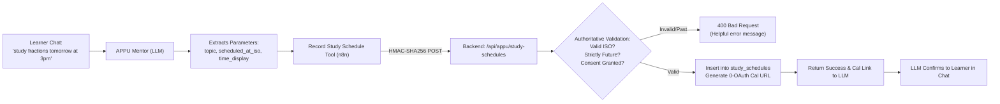
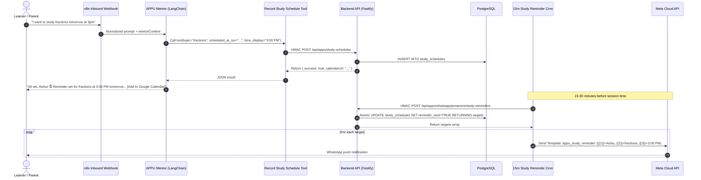

# APPU Study Reminders & Google Calendar Integration Design Specification

Date: 2026-09-08  
Status: Draft design for coordinator review  
Scope: Study Reminders & Calendar Sub-Phase (Deferred Sub-Phase of Phase 2 Parent Automations)

---

## 1. Executive Summary & Authoritative Principles

This specification designs the **Study Reminders and Google Calendar Integration** subsystem for APPU. It provides an end-to-end mechanism whereby a learner or parent expressing a study intent in WhatsApp chat (e.g., *"I'll study fractions tomorrow at 3pm"*) has their schedule captured reliably, receives a 1-tap Google Calendar link, and receives a proactive, server-verified WhatsApp reminder shortly before the study session begins.

### Scope & Active Template Confirmation

The proactive reminder utilizes the approved Meta Cloud API message template:

| Template Name | Meta Status | Category | Variables | Trigger / Frequency |
| :--- | :--- | :--- | :--- | :--- |
| **`appu_study_reminder`** | **APPROVED / Active** | Utility | `{{1}}` child name, `{{2}}` topic, `{{3}}` time | 15–30 min prior to scheduled study time (15-min cron) |

**Template Text Format:**
> *"Hi {{1}}! ⏰ Reminder: you planned to study {{2}} at {{3}} today. Open APPU whenever you're ready to begin!"*

- **Language Code:** `'en'` (registered under WABA `1041501015099784`).
- **Category:** `UTILITY` (guaranteed delivery, zero marketing opt-out blocks).

### Authoritative Invariants

1. **Consent & Parent Phone Invariant:** Proactive WhatsApp reminders are dispatched strictly to households where `households.whatsapp_consent = TRUE` and `households.parent_phone IS NOT NULL` (Migration 015). If consent is missing or revoked, no message is dispatched.
2. **Server-Authoritative Time & Validation:** While the inbound AI assistant extracts natural language time intent, the backend server strictly validates dates:
   - Must parse into a valid ISO 8601 timestamp.
   - Must be strictly in the future (`scheduled_at > NOW()`).
   - Must be within a realistic horizon (maximum 60 days ahead).
   - Past dates, unparseable dates, or out-of-range dates are rejected authoritatively with HTTP 400 Bad Request.
3. **Atomic Concurrency & Zero Double-Sends:** Due study reminders are queried and marked sent atomically using PostgreSQL:
   ```sql
   WITH due AS (
     SELECT id FROM study_schedules
     WHERE reminder_sent = FALSE AND scheduled_at <= NOW() + INTERVAL '30 minutes'
     FOR UPDATE SKIP LOCKED LIMIT $1
   )
   UPDATE study_schedules SET reminder_sent = TRUE, reminder_sent_at = NOW()
   WHERE id IN (SELECT id FROM due) RETURNING ...
   ```
   This guarantees zero duplicate messages across concurrent cron runs or worker restarts.
4. **Zero-OAuth Frictionless Calendar Architecture:** Parents and learners interact over WhatsApp without Google account linkage. Rather than requiring OAuth token authorization (which introduces fatal drop-off), APPU provides a **0-OAuth Direct Google Calendar Web Intent URL** pre-filled with the session details, alongside the guaranteed WhatsApp reminder push.
5. **Fail-Safe Operation:** All proactive cron endpoints return HTTP 200 with structured JSON (`{ success: false, ... }`) even upon internal exceptions to prevent cascading failures in n8n scheduling loops.

---

## 2. Audit Findings & Baseline Analysis

### A. Upstream n8n Workflow (`drr7AUOcj1VrU0j8`) Audit

1. **Existing Google Calendar Node:**
   - **Node Name:** `Create an event in Google Calendar`
   - **Node Type:** `n8n-nodes-base.googleCalendarTool` (v1.3)
   - **Configured Credential:** `la60UP5jvTDO4zHz` (`Google Calendar account`, Google Cloud project *"Quantumweave academy <quantumweave26@gmail.com>"*).
   - **Target Calendar:** Hardcoded to `testnh145@gmail.com`.
   - **Critical Gap:** This tool writes strictly to a single developer/test email calendar. It does *not* create events on the parent's or child's calendar. Because parents onboard via WhatsApp mobile without Google OAuth, executing this tool creates invisible events on an internal test calendar while consuming API quotas.
   - **Recommendation:** Disconnect/retire this node from the `APPU Mentor` LangChain agent.

2. **Inbound Context & Phone Flow:**
   - `Normalize WhatsApp Input` captures the sender's phone number in `from` (digits only, e.g., `918618030563`).
   - It calls `POST /api/appu/whatsapp/context` with HMAC-SHA256 headers (`X-APPU-Timestamp`, `X-APPU-Signature`) and resolves `mentorContext`, `householdId`, and `childId`.
   - The AI agent has access to learner identity and context. When an AI tool is invoked, it can pass either the sender phone or the resolved household/child IDs.

3. **LangChain AI Tool Pattern:**
   - Existing tools on `APPU Mentor` (e.g., `Class 6-12 NCERT Textbook Knowledge Engine`, `Parent Weekly Digest Tool`) use `@n8n/n8n-nodes-langchain.toolCode`.
   - Modern n8n supports `@n8n/n8n-nodes-langchain.toolCode` where inputs are passed as parameters or extracted via `$fromAI`.

### B. Database Schema Baseline (Migrations 001–017)

- `households`: contains `id`, `parent_phone` (VARCHAR 32), `whatsapp_consent` (BOOLEAN), `whatsapp_consent_at` (TIMESTAMPTZ).
- `child_profiles`: contains `id`, `household_id`, `preferred_name`, `nickname` (Migration 016), `dob` (DATE, Migration 016), `grade_band`, `status` ('ACTIVE').
- **Pending Gap:** No table exists to store scheduled study commitments, topic details, reminder states, or calendar links.
- **Migration Required:** `018_study_schedules.sql` must be introduced.

---

## 3. The Google Calendar Fork: Evaluation & Decision

A central architectural question for the Calendar integration is how calendar events are created and delivered to parents/learners. We evaluate three distinct technical paths:

| Dimension | Option A: Per-Parent OAuth 2.0 | Option B: Central Business Account | Option C: 0-OAuth Direct URL + WhatsApp (Recommended) |
| :--- | :--- | :--- | :--- |
| **Mechanism** | Each parent authenticates via Google OAuth; server stores refresh tokens and writes via Google Calendar API. | Service account or OAuth writes all events to `testnh145@gmail.com` and invites parent email. | Server generates a standard Google Calendar Web Intent URL; WhatsApp sends the proactive push notification. |
| **User Friction** | **Extreme (>90% drop-off).** WhatsApp users must open external browser, sign into Google, grant calendar scopes, bypass unverified app warnings. | **High / Impractical.** WhatsApp users do not provide email addresses during onboarding; without email, no invite can be received. | **Zero friction.** 1-tap addition from chat confirmation; no login or authorization required. |
| **Privacy & Security** | High risk; requires secure vaulting of long-lived Google OAuth refresh tokens with read/write access. | Multi-tenant risk; mixing thousands of learner study sessions on one shared calendar risks accidental data leakage. | **Zero risk.** Zero token storage; learner data stays strictly in APPU PostgreSQL; URL opened client-side. |
| **Reliability of Reminder** | Depends on parent having notifications enabled on Google Calendar app. | None for parent (event is on business calendar). | **98%+ delivery rate.** Meta WhatsApp Utility template delivered directly to parent's phone. |
| **Operational Overhead** | Complex OAuth app verification with Google Cloud, token rotation, revoked token handling. | Severe API rate limits (100k events/day across all users), calendar clutter. | **Negligible.** Zero external API dependencies during event generation. |

### Authoritative Recommendation: Option C

1. **WhatsApp Is the Primary Push Reminder Channel:**
   In India's K-12 demographic, WhatsApp has a >98% open rate, whereas personal Google Calendar notification hygiene among school children is low. The approved `appu_study_reminder` template serves as the authoritative, guaranteed reminder.
2. **0-OAuth Direct Google Calendar Link as Value-Add:**
   When APPU records the schedule, it returns a 1-tap Google Calendar template URL:
   ```
   https://calendar.google.com/calendar/render?action=TEMPLATE&text={Title}&dates={StartUTC}/{EndUTC}&details={Description}&location=APPU+AI+Tutor
   ```
   The learner or parent can tap this link in chat, and it immediately opens their native Google Calendar application with pre-populated title, date, time, and topic—ready to save in one tap.
3. **Retirement of Legacy Node:**
   Disconnect the existing `Create an event in Google Calendar` node from `APPU Mentor`. This eliminates misleading logs, removes linter warnings in n8n, and prevents unauthorized quota consumption on internal accounts.

---

## 4. Natural Language Time Parsing & Authoritative Validation

### A. Division of Responsibility: Hybrid Extraction + Authoritative Gate



### B. LLM Extraction Contract

The AI agent is supplied with the current server time and Indian Standard Time context in `mentorContext` or system instructions:
- Current timestamp (e.g., `2026-09-08T17:00:00+05:30`).
- Current timezone: `Asia/Kolkata` (UTC+05:30).

When the learner states an intent to study, the tool is called with:
- `topic`: Clean string of the subject or topic (e.g., `"Fractions"`, `"Light and Reflection"`).
- `scheduled_at_iso`: Full ISO 8601 string calculated relative to the current timestamp (e.g., `"2026-09-09T15:00:00+05:30"`).
- `time_display`: Human-readable 12-hour time string for WhatsApp template variable `{{3}}` (e.g., `"3:00 PM"` or `"5:30 PM"`).
- `raw_expression`: Original phrasing for auditability (e.g., `"tomorrow at 3pm"`).

### C. Server-Side Authoritative Gate

The backend endpoint `POST /api/appu/study-schedules` validates:
1. **Timestamp Format:** Must parse via `Date.parse()` into a valid finite timestamp.
2. **Strict Future Requirement:** `new Date(scheduledAt).getTime() > Date.now() + 60_000` (at least 1 minute into the future).
   - If in the past: Returns `400 Bad Request` with code `TIME_IN_PAST` and message *"Scheduled time must be in the future. Please specify an upcoming time."*
3. **Horizon Boundary:** `new Date(scheduledAt).getTime() <= Date.now() + 60 * 24 * 60 * 60 * 1000` (maximum 60 days ahead).
4. **String Length & Sanitization:**
   - `topic`: 1 to 150 characters, trimmed, control characters stripped.
   - `timeDisplay`: 1 to 50 characters, sanitized.
5. **Timezone Standardization:** Stored canonically as UTC `TIMESTAMPTZ`.

---

## 5. Database Schema: Migration 018 (`study_schedules`)

File: `backend/db/migrations/018_study_schedules.sql`

```sql
-- ==============================================================================
-- Migration: 018_study_schedules.sql
-- Description: Learner study schedules and proactive reminder state
-- ==============================================================================

CREATE TABLE IF NOT EXISTS study_schedules (
    id UUID PRIMARY KEY DEFAULT gen_random_uuid(),
    household_id UUID NOT NULL REFERENCES households(id) ON DELETE CASCADE,
    child_id UUID NOT NULL REFERENCES child_profiles(id) ON DELETE CASCADE,
    topic VARCHAR(150) NOT NULL,
    scheduled_at TIMESTAMPTZ NOT NULL,
    time_display VARCHAR(50) NOT NULL,
    raw_expression VARCHAR(150) NULL,
    reminder_sent BOOLEAN NOT NULL DEFAULT FALSE,
    reminder_sent_at TIMESTAMPTZ NULL,
    calendar_event_id VARCHAR(255) NULL,
    created_at TIMESTAMPTZ NOT NULL DEFAULT NOW()
);

-- Partial index for fast, lock-free polling of pending study reminders by cron
CREATE INDEX IF NOT EXISTS idx_study_schedules_pending_reminders
    ON study_schedules (scheduled_at)
    WHERE reminder_sent = FALSE;

-- Index for learner schedule retrieval and deduplication
CREATE INDEX IF NOT EXISTS idx_study_schedules_lookup
    ON study_schedules (household_id, child_id, scheduled_at DESC);

COMMENT ON TABLE study_schedules IS 'Scheduled study sessions captured from conversational intent';
COMMENT ON COLUMN study_schedules.time_display IS 'Preformatted 12-hour time string (e.g. 3:00 PM) for Meta template parameter {{3}}';
COMMENT ON COLUMN study_schedules.reminder_sent IS 'Flag indicating whether the appu_study_reminder proactive message was dispatched';
```

---

## 6. Backend Architecture & REST API Endpoints

### A. Domain Directory Structure

```
backend/src/domain/study-schedule/
├── index.ts              # Clean module exports
├── types.ts              # TypeScript domain types & interfaces
├── repository.ts         # SQL queries with atomic CTE claiming
└── service.ts            # Business logic, validation, Google Calendar URL generator
```

### B. Domain Types (`types.ts`)

```typescript
export interface StudyScheduleRecord {
  id: string;
  householdId: string;
  childId: string;
  topic: string;
  scheduledAt: Date;
  timeDisplay: string;
  rawExpression: string | null;
  reminder_sent: boolean;
  reminder_sent_at: Date | null;
  calendar_event_id: string | null;
  createdAt: Date;
}

export interface CreateStudyScheduleInput {
  phone: string;
  topic: string;
  scheduledAt: string;
  timeDisplay?: string;
  rawExpression?: string;
}

export interface StudyReminderClaimTarget {
  scheduleId: string;
  householdId: string;
  childId: string;
  childName: string;
  parentPhone: string;
  topic: string;
  scheduledAt: Date;
  timeDisplay: string;
}
```

### C. 0-OAuth Google Calendar URL Generator

Implemented within `StudyScheduleService`:

```typescript
export function generateGoogleCalendarUrl(params: {
  topic: string;
  scheduledAt: Date;
  childName: string;
  durationMinutes?: number;
}): string {
  const duration = params.durationMinutes ?? 45;
  const startTime = params.scheduledAt;
  const endTime = new Date(startTime.getTime() + duration * 60 * 1000);

  const formatUtcCompact = (d: Date): string =>
    d.toISOString().replace(/[-:]/g, '').split('.')[0] + 'Z';

  const title = encodeURIComponent(`Study ${params.topic} with APPU`);
  const dates = `${formatUtcCompact(startTime)}/${formatUtcCompact(endTime)}`;
  const details = encodeURIComponent(
    `Scheduled study session for ${params.childName}.\n\nTopic: ${params.topic}\n\nOpen APPU to start learning!`
  );
  const location = encodeURIComponent('APPU AI Tutor (WhatsApp)');

  return `https://calendar.google.com/calendar/render?action=TEMPLATE&text=${title}&dates=${dates}&details=${details}&location=${location}`;
}
```

### D. REST Endpoint 1: Record Study Schedule

- **Method & Path:** `POST /api/appu/study-schedules`
- **Authentication:** Strict HMAC-SHA256 signature (`X-APPU-Timestamp`, `X-APPU-Signature`) using `N8N_APPU_CALLBACK_HMAC_SECRET`.
- **Request Payload (Zod schema):**
  ```json
  {
    "phone": "918618030563",
    "topic": "fractions",
    "scheduledAt": "2026-09-09T15:00:00+05:30",
    "timeDisplay": "3:00 PM",
    "rawExpression": "tomorrow at 3pm"
  }
  ```
- **Success Response (200 OK):**
  ```json
  {
    "success": true,
    "schedule": {
      "id": "c21b3690-6712-4211-9a1c-ecff4735591b",
      "childName": "Aishu",
      "topic": "Fractions",
      "scheduledAt": "2026-09-09T09:30:00.000Z",
      "timeDisplay": "3:00 PM",
      "calendarUrl": "https://calendar.google.com/calendar/render?action=TEMPLATE&text=Study+Fractions+with+APPU&dates=20260909T093000Z%2F20260909T101500Z&details=..."
    }
  }
  ```
- **Error Responses:**
  - `400 Bad Request`: Invalid timestamp format, timestamp in the past, or missing parameters.
  - `401 Unauthorized`: Missing or invalid HMAC signature.
  - `404 Not Found`: Household not found by parent phone or WhatsApp consent not granted.

### E. REST Endpoint 2: Fetch & Claim Proactive Study Reminders

- **Method & Path:** `POST /api/appu/whatsapp/proactive/study-reminders`
- **Authentication:** Strict HMAC-SHA256 signature.
- **Request Payload:**
  ```json
  {
    "dryRun": false,
    "limit": 200,
    "windowMinutes": 30
  }
  ```
- **Query & Atomic Claim (CTE with Row Locking):**
  ```sql
  WITH due_schedules AS (
    SELECT s.id
    FROM study_schedules s
    JOIN households h ON h.id = s.household_id
    JOIN child_profiles c ON c.id = s.child_id
    WHERE s.reminder_sent = FALSE
      AND s.scheduled_at <= (NOW() + ($1 || ' minutes')::interval)
      AND s.scheduled_at >= (NOW() - INTERVAL '15 minutes')
      AND h.whatsapp_consent = TRUE
      AND h.parent_phone IS NOT NULL
      AND c.status = 'ACTIVE'
    ORDER BY s.scheduled_at ASC
    LIMIT $2
    FOR UPDATE OF s SKIP LOCKED
  )
  UPDATE study_schedules
  SET reminder_sent = CASE WHEN $3 = TRUE THEN FALSE ELSE TRUE END,
      reminder_sent_at = CASE WHEN $3 = TRUE THEN NULL ELSE NOW() END
  WHERE id IN (SELECT id FROM due_schedules)
  RETURNING id, household_id, child_id, topic, scheduled_at, time_display;
  ```
- **Success Response (200 OK):**
  ```json
  {
    "success": true,
    "jobType": "study-reminders",
    "generatedAt": "2026-09-08T17:00:00.000Z",
    "count": 1,
    "targets": [
      {
        "householdId": "1c905b76-4c40-4bc3-9584-c8cba0285a81",
        "childId": "bfa07e5e-e478-45e3-b9dc-06b5ae2be5a8",
        "recipientPhone": "918618030563",
        "templateName": "appu_study_reminder",
        "templateLanguage": "en",
        "parameters": [
          { "type": "text", "text": "Aishu" },
          { "type": "text", "text": "fractions" },
          { "type": "text", "text": "3:00 PM" }
        ]
      }
    ]
  }
  ```

---

## 7. n8n Upstream Workflow Architecture (Production-Gated)



### A. New Tool Node: `Record Study Schedule Tool`
- Attached to `APPU Mentor` as an `ai_tool`.
- Type: `@n8n/n8n-nodes-langchain.toolCode`
- Description: *"Use this tool whenever the learner or parent schedules a study session or asks for a reminder for a specific topic and time. Provide topic, scheduled_at_iso, and time_display. Returns a confirmation and Google Calendar link."*
- Code executes HMAC-SHA256 request using `$env.N8N_APPU_CALLBACK_HMAC_SECRET`.

### B. 15-Minute Study Reminder Cron Pipeline
- **Trigger:** `Study Reminder 15m Cron` (`scheduleTrigger` v1.2, cron expression: `*/15 * * * *`).
- **Fetch Node:** `Fetch Due Study Reminders` (`code` node v2 calling `POST /api/appu/whatsapp/proactive/study-reminders`).
- **Conditional:** `Has Due Reminders?` (`if` node checking `$json.count > 0`).
- **Send Node:** Dispatches `appu_study_reminder` via Meta Graph API (`https://graph.facebook.com/v20.0/1288446054350994/messages`).

---

## 8. Security, Privacy & Failure Modes

1. **Replay Protection:** All requests verify `X-APPU-Timestamp` against a 300-second maximum skew.
2. **Consent Revocation Safety:** If a parent revokes WhatsApp consent (`whatsapp_consent = FALSE`), all pending reminders for that household are immediately excluded from proactive cron queries.
3. **Double-Send Prevention:** The PostgreSQL CTE with `FOR UPDATE SKIP LOCKED` guarantees that even if two cron instances fire simultaneously, each schedule is claimed by exactly one runner.
4. **Graceful Fail-Safe:** If backend database connection fails during cron polling, the endpoint catches the error and returns `{ success: false, count: 0, targets: [] }` with HTTP 200, logging internally while keeping n8n healthy.

---

## 9. Verification & Acceptance Criteria

1. **Migration Verification:** Migration 018 creates `study_schedules` table and partial indexes idempotently.
2. **Repository Unit Tests:**
   - Insertion with valid parameters.
   - Atomic claiming of due records without double-claiming.
   - Exclusion of records where consent is false or time is outside the window.
3. **Service Unit Tests:**
   - Rejection of past dates.
   - Validation of horizon bounds.
   - Deterministic 0-OAuth Google Calendar URL generation.
4. **Route Integration Tests:**
   - Valid HMAC signature accepted; invalid/expired signature rejected (401).
   - Past date returns 400 Bad Request.
   - End-to-end schedule creation and proactive target generation.
5. **n8n Verification (Gated):**
   - Active workflow version tested with a dry-run execution.
   - Confirmation of `appu_study_reminder` delivery with genuine Meta `wamid`.
