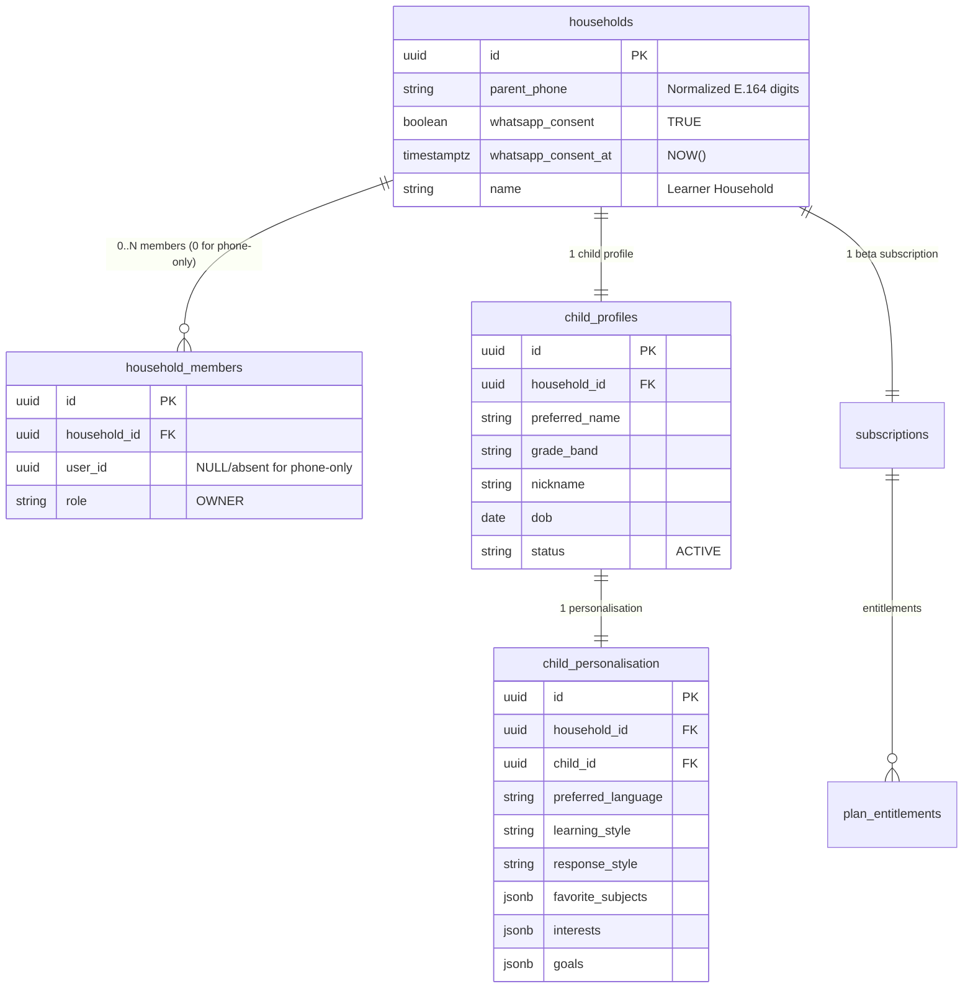
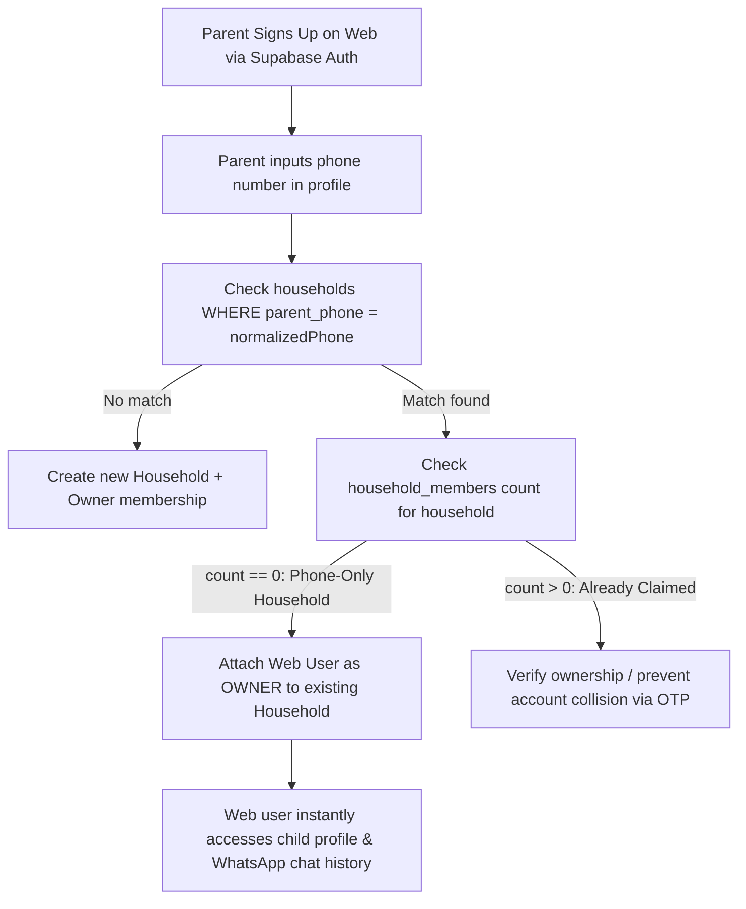

# APPU WhatsApp-Side Conversational Onboarding Design

**Date:** 2026-09-09  
**Status:** Draft Design for Coordinator Review (Atlas req `4dd3e6b9-7948-4994-aa21-a10ae9e22de0`)  
**Phase:** Specification & Architectural Audit (Strictly Read-Only — No code, commits, or migrations until approved)

---

## 1. Executive Summary & Goals

Today, when an unrecognized number messages the APPU WhatsApp line, the system treats them as a generic guest and nudges them:
> *"💡 Tip: Link your WhatsApp number in your APPU account profile to sync your learning journey here!"*

This specification turns the APPU WhatsApp channel from **read-only** to **read-write**, transforming incoming WhatsApp messages from new or incomplete learners into a frictionless, guided conversational onboarding experience.

### Core Objectives
1. **Recognized & Complete Profile:** Continue existing personalized tutoring path (`whatsapp-context-sync`, v6f75153e).
2. **New Number or Incomplete Profile:** Guide the learner conversationally through full personalization fields **one by one**, saving incrementally to a phone-only profile in PostgreSQL via authenticated HMAC endpoints.
3. **Seamless Tutoring Transition:** Once all required fields are collected, transition smoothly into personalized tutoring without requiring app/web registration.
4. **Link-Later Web Merging:** If the parent later creates a web account with the same phone number, attach the web user directly to the existing phone-only household without losing data or duplicating profiles.

---

## 2. Authoritative Decisions & Scope Boundaries

1. **Account Model (Phone-Only):**
   - Learner profiles created via WhatsApp require **NO email and NO password**.
   - The verified WhatsApp sender phone (`from` digits) is the primary anchor.
2. **Field Scope (Full Web Parity):**
   - Exactly matches the 9 core fields collected by the web/app personalization flow:
     1. Child Name / Nickname (`child_profiles.preferred_name` / `nickname`)
     2. Grade / Class (`child_profiles.grade_band`)
     3. Date of Birth / Age (`child_profiles.dob`, age 3–25)
     4. Primary Language (`child_personalisation.preferred_language`, e.g., `en`, `hi`, `kn`)
     5. Favorite Subjects (`child_personalisation.favorite_subjects`, array of strings)
     6. Interests & Hobbies (`child_personalisation.interests`, array of strings)
     7. Learning Style (`child_personalisation.learning_style`, enum: `visual`, `auditory`, `kinesthetic`, `reading_writing`, `interactive`)
     8. Response Style (`child_personalisation.response_style`, enum: `playful`, `balanced`, `focused`)
     9. Learning Goals (`child_personalisation.goals`, array of strings)
3. **Explicit Consent:**
   - Explicit conversational consent question in the onboarding flow (e.g., *"Would you like daily learning tips and study updates on WhatsApp?"*).
   - `whatsapp_consent = TRUE` and `whatsapp_consent_at = NOW()` are recorded ONLY when the parent/learner confirms affirmatively (does not default to true).
4. **Single-Child Invariant:**
   - Exactly ONE child profile per phone number/household. No multi-child disambiguation on WhatsApp.
5. **Phase-Gated Execution:**
   - Backend domain, validation, and HMAC endpoints are built and tested first (`node:test` in `backend/tests/`).
   - n8n workflow wiring on `drr7AUOcj1VrU0j8` is production-gated and coordinated by Atlas.

---

## 3. Database Schema & Data Model Audit

### Key Finding: Zero Migrations Required
An exhaustive audit of migrations `001_initial_tenancy.sql`, `004_child_personalisation.sql`, `015_household_whatsapp_preferences.sql`, and `016_child_nickname_and_dob.sql` confirms that **phone-only households can exist today in PostgreSQL without any schema modifications**.

#### Detailed Schema Proof:
1. **`households` Table:**
   - Root entity with `id UUID PRIMARY KEY`, `name VARCHAR(255)`, `parent_phone VARCHAR(32)`, `whatsapp_consent BOOLEAN`, `whatsapp_consent_at TIMESTAMPTZ`.
   - **Crucially:** `households` has **no foreign key** to `auth.users` or `household_members`.
2. **`household_members` Table:**
   - Connects `user_id` (Supabase auth user) to `household_id`.
   - It is a 1-to-many child table. A `household` with **zero** `household_members` rows is 100% valid in PostgreSQL.
3. **`child_profiles` Table:**
   - References `households(id)` directly via `household_id UUID NOT NULL REFERENCES households(id) ON DELETE CASCADE`.
   - Contains `preferred_name`, `grade_band`, `status`, `nickname`, `dob`.
4. **`child_personalisation` Table:**
   - References `child_profiles(household_id, child_id)` with unique constraint.
5. **Subscription & Entitlements:**
   - `ensureBetaSubscription(db, household.id, 30)` assigns the free beta plan directly to `household_id` without requiring a user ID, immediately unlocking all entitlements (`multilingual: true`, `advanced_personalisation: true`).

### Data Model Entity Relationships


---

## 4. State Management: Incremental DB Persistence vs n8n Memory

### Architectural Recommendation: Persistent Partial DB Profile
We strongly recommend **storing partial profile state incrementally in the database** rather than in ephemeral n8n execution memory or `memoryBufferWindow`.

| Dimension | In-Memory (n8n Window) | Persistent DB Profile (Recommended) |
| :--- | :--- | :--- |
| **Asynchronous Resumption** | Fails: Drop-off > 8 turns or hours later loses collected fields. | **100% Resilient:** Student can pause for 2 days and resume seamlessly. |
| **Crash & Deploy Safety** | Lost on n8n execution restart or deployment. | **Safe:** ACID-compliant PostgreSQL storage. |
| **Web Sync Parity** | Web app cannot see partial progress. | **Instant Parity:** Web signup instantly sees whatever fields were answered. |
| **LLM Cognitive Load** | LLM must track what was asked in conversation history. | **Zero Ambiguity:** Backend returns exact `missingFields` and `nextPromptField`. |

---

## 5. Field Completeness Rubric

A learner profile is evaluated by `WhatsAppOnboardingService.evaluateCompleteness`:

| Field | Storage Location | Validation Criteria | Default / Initial State |
| :--- | :--- | :--- | :--- |
| **1. Name** | `child_profiles.preferred_name` | Trimmed string, length 1–100, safe characters | Required |
| **2. Grade** | `child_profiles.grade_band` | Trimmed string, length 1–50, e.g. "Class 8" | Required |
| **3. Date of Birth** | `child_profiles.dob` | `YYYY-MM-DD`, valid calendar date, age 3–25 | Required |
| **4. Primary Language**| `child_personalisation.preferred_language` | Regex `^[a-z]{2}(-[A-Z]{2})?$`, e.g. `en`, `hi`, `kn` | `'en'` |
| **5. Favorite Subjects**| `child_personalisation.favorite_subjects` | Array of strings, `length >= 1` | `[]` |
| **6. Interests** | `child_personalisation.interests` | Array of strings, `length >= 1` | `[]` |
| **7. Learning Style** | `child_personalisation.learning_style` | Enum: `visual`, `auditory`, `kinesthetic`, `reading_writing`, `interactive` | `'visual'` |
| **8. Response Style** | `child_personalisation.response_style` | Enum: `playful`, `balanced`, `focused` | `'playful'` |
| **9. Goals** | `child_personalisation.goals` | Array of strings, `length >= 1` | `[]` |

*Profile Status Rule:*
- **Complete:** All 9 fields satisfy their validation criteria.
- **Incomplete:** At least one field is missing or empty. The backend dynamically determines `nextPromptField` using the canonical sequence: `name` -> `grade` -> `dob` -> `preferredLanguage` -> `favoriteSubjects` -> `interests` -> `learningStyle` -> `responseStyle` -> `goals`.

---

## 6. API Architecture & HMAC Endpoints

All endpoints are hosted in Fastify under `/api/appu/whatsapp/` and authenticated via strict HMAC-SHA256 (`x-appu-signature`, `x-appu-timestamp`, `N8N_APPU_CALLBACK_HMAC_SECRET`).

### Endpoint 1: Resolve Onboarding State (`POST /api/appu/whatsapp/onboarding/state`)
Read-only resolution of a phone number's onboarding completeness and personalization state.

**Headers:**
- `x-appu-timestamp`: Unix timestamp (ms)
- `x-appu-signature`: HMAC-SHA256 signature of `${timestamp}.${body}` using `N8N_APPU_CALLBACK_HMAC_SECRET`

**Request:**
```json
{
  "phone": "919740595677"
}
```

**Response (Unrecognized / New User):**
```json
{
  "recognized": false,
  "complete": false,
  "missingFields": [
    "name",
    "grade",
    "dob",
    "preferredLanguage",
    "favoriteSubjects",
    "interests",
    "learningStyle",
    "responseStyle",
    "goals",
    "whatsappConsent"
  ],
  "householdId": null,
  "childId": null,
  "personalisation": null
}
```

**Response (Incomplete Profile):**
```json
{
  "recognized": true,
  "complete": false,
  "missingFields": [
    "dob",
    "preferredLanguage",
    "favoriteSubjects",
    "interests",
    "learningStyle",
    "responseStyle",
    "goals",
    "whatsappConsent"
  ],
  "householdId": "b3e3e8cb-7e3f-4e08-96c8-111111111111",
  "childId": "c4f4f9da-8f4a-5f19-07d9-222222222222",
  "personalisation": {
    "name": "Aarav",
    "nickname": null,
    "grade": "Grade 8",
    "dob": null,
    "preferredLanguage": "en",
    "favoriteSubjects": [],
    "interests": [],
    "learningStyle": null,
    "responseStyle": null,
    "goals": [],
    "whatsappConsent": false
  }
}
```

**Response (Recognized & Complete):**
```json
{
  "recognized": true,
  "complete": true,
  "missingFields": [],
  "householdId": "b3e3e8cb-7e3f-4e08-96c8-111111111111",
  "childId": "c4f4f9da-8f4a-5f19-07d9-222222222222",
  "personalisation": {
    "name": "Aarav",
    "nickname": null,
    "grade": "Grade 8",
    "dob": "2012-07-15",
    "preferredLanguage": "en",
    "favoriteSubjects": ["Mathematics", "Science"],
    "interests": ["Robotics", "Cricket"],
    "learningStyle": "visual",
    "responseStyle": "playful",
    "goals": ["Score 90% in CBSE Math"],
    "whatsappConsent": true
  }
}
```

---

### Endpoint 2: Incremental Onboarding Write (`POST /api/appu/whatsapp/onboarding/save-step`)
Atomically creates/finds phone-only household & child, validates input fields with web/app parity schemas, applies updates, provisions beta subscription, and returns refreshed state.

**Headers:**
- `x-appu-timestamp`: Unix timestamp (ms)
- `x-appu-signature`: HMAC-SHA256 signature

**Request (Single Field):**
```json
{
  "phone": "919740595677",
  "field": "grade",
  "value": "Grade 8"
}
```

*Or Multi-Field Batch:*
```json
{
  "phone": "919740595677",
  "fields": {
    "name": "Aarav",
    "grade": "Grade 8",
    "dob": "2012-07-15",
    "whatsappConsent": true
  }
}
```

**Supported Fields:**
- `name` (string, 1–100 chars, no forbidden `<>$` chars)
- `nickname` (string, 1–50 chars, optional)
- `grade` (string, 1–50 chars, e.g. "Grade 6", "Class 8")
- `dob` (string, `YYYY-MM-DD`, age 3–25)
- `preferredLanguage` (string, regex `^[a-z]{2}(-[A-Z]{2})?$`, e.g. `en`, `hi`, `kn`)
- `favoriteSubjects` (string or string[])
- `interests` (string or string[])
- `learningStyle` (`visual` | `auditory` | `kinesthetic` | `reading_writing` | `interactive`)
- `responseStyle` (`playful` | `balanced` | `focused`)
- `goals` (string or string[])
- `whatsappConsent` (boolean: explicit opt-in confirmation; must be affirmatively `true`, does NOT default to `true`)

**Automatic Subscription Provisioning:**
- Every invocation of `save-step` executes `ensureBetaSubscription(tx, household.id, betaChatLimit ?? 30)`.
- On the very first call (e.g. saving the learner's name), this immediately provisions the active beta subscription and all plan entitlements (`multilingual: true`, `advanced_personalisation: true`, `monthly_ai_sessions: 30`).
- Subsequent calls no-op cleanly. This guarantees WhatsApp learners are never blocked by subscription/entitlement gates.

**Response:**
```json
{
  "success": true,
  "recognized": true,
  "complete": false,
  "missingFields": [
    "dob",
    "preferredLanguage",
    "favoriteSubjects",
    "interests",
    "learningStyle",
    "responseStyle",
    "goals",
    "whatsappConsent"
  ],
  "householdId": "b3e3e8cb-7e3f-4e08-96c8-111111111111",
  "childId": "c4f4f9da-8f4a-5f19-07d9-222222222222",
  "personalisation": {
    "name": "Aarav",
    "nickname": null,
    "grade": "Grade 8",
    "dob": null,
    "preferredLanguage": "en",
    "favoriteSubjects": [],
    "interests": [],
    "learningStyle": null,
    "responseStyle": null,
    "goals": [],
    "whatsappConsent": false
  }
}
```

---

### Endpoint 3: Enhanced Context Resolution (`POST /api/appu/whatsapp/context`)
Existing context endpoint enhanced to also return the `onboarding` state block for pre-agent normalization.

---

## 7. Upstream n8n Integration (`drr7AUOcj1VrU0j8`)

### A. Pre-Agent Normalization (`Normalize WhatsApp Input`)
Calls `POST /api/appu/whatsapp/context`. Passes `onboarding` object into the pipeline:
```javascript
// Attaches onboarding context to agent runtime JSON
return [{
  json: {
    ...j,
    agent_input: effectiveAgentInput,
    mentorContext,
    onboarding: resData.onboarding ?? { isComplete: false, nextPromptField: 'name' },
    conversationHistory,
    channel: 'whatsapp',
    user_key: from,
    sessionKey: j.sessionKey ?? `whatsapp:${from}:v5`,
    task_type: 'conversation',
    user_type: resData.recognized ? 'learner' : 'onboarding_guest'
  }
}];
```

### B. New Tool: `Save Learner Profile Step` (`save_onboarding_step`)
Attached as an `@n8n/n8n-nodes-langchain.toolCode` directly to `APPU Mentor`:
- **Tool Name:** `save_onboarding_step`
- **Description:**
  > *"Saves a learner personalization detail collected during conversational onboarding. Call this when the learner provides their name, grade, DOB/age, favorite subjects, interests, learning style, response style, learning goals, or preferred language. Parameters: field (string: name | grade | dob | preferredLanguage | favoriteSubjects | interests | learningStyle | responseStyle | goals), value (string or array of strings)."*
- **Execution:** Performs signed HMAC POST to `/api/appu/whatsapp/onboarding/save-step`.

### C. Conversational Agent Prompt Rules
In `APPU Mentor` system prompt (Section 16: RUNTIME CONTEXT):
```text
Runtime Onboarding State: {{ JSON.stringify($json.onboarding || {}) }}

ONBOARDING & PERSONALIZATION CONVERSATIONAL FLOW:
If runtime onboarding.isComplete is false:
1. Warm Guide: You are welcoming a new student or finishing their setup. Keep it warm, fun, and fast.
2. One Question at a Time: Ask ONLY for the next missing field (guided by onboarding.nextPromptField).
3. Flexible Understanding:
   - If they state their age (e.g., "I'm 13"), compute approximate DOB (e.g. 2013-01-01) and save it.
   - If they answer multiple items in one message (e.g., "I'm Priya in 9th grade, I love biology and coding"), call save_onboarding_step for each field immediately.
4. Immediate Tool Invocation: Always call save_onboarding_step before generating the conversational reply.
5. Completion Celebration: When all fields are saved (onboarding.isComplete becomes true), congratulate the student warmly, acknowledge their specific interests/goals, and immediately invite them to ask their first study question!
```

---

## 8. Link-Later Web Account Merging Strategy (Deferred to OTP Milestone)

> [!NOTE]
> **Security Audit Decision (2026-09-11):** Link-later account claiming via unverified request-body phone has been deferred to a separate milestone that includes cryptographic/SMS OTP verification of phone ownership. In this initial release, phone-only WhatsApp profiles remain isolated and self-contained without risking account takeover.

When a user who onboarded via WhatsApp later registers or signs in on the web app:



### Implementation in `TenancyService.claimPhoneOnlyHousehold`:
```typescript
public static async claimPhoneOnlyHousehold(
  db: TransactionalQueryable,
  userId: string,
  rawPhone: string
): Promise<ClaimHouseholdResult> {
  const normalized = normalizePhoneNumber(rawPhone);
  return db.transaction(async (tx) => {
    // 1. Find household by phone
    const household = await TenancyRepository.findHouseholdByParentPhone(tx, normalized);
    if (!household) return { claimed: false, reason: 'NOT_FOUND' };

    // 2. Check if household is phone-only (zero members)
    const members = await TenancyRepository.listHouseholdMembers(tx, household.id);
    if (members.length > 0) return { claimed: false, reason: 'ALREADY_CLAIMED' };

    // 3. Link web user as initial OWNER
    const owner = await TenancyRepository.createHouseholdMember(tx, {
      householdId: household.id,
      userId,
      role: HouseholdRoles.OWNER
    });

    return { claimed: true, household, owner };
  });
}
```

---

## 9. Verification, Test Strategy & Safety

1. **Unit & Integration Tests (`backend/tests/whatsapp-onboarding.test.ts`):**
   - Resolving context for new phone returns `recognized: false` and `onboarding.isComplete: false`.
   - Saving `name` creates phone-only household, child profile, and partial personalisation.
   - Saving subsequent fields (`grade`, `dob`, `subjects`, `interests`, `learningStyle`, `responseStyle`, `goals`, `preferredLanguage`) updates records incrementally.
   - Input validation: invalid DOB (<3 or >25 years), invalid enum values, unsafe characters rejected with 400.
   - Idempotency & multi-field saving verified.
   - Replay attack rejection (HMAC timestamp expiry >300s, signature mismatch).
   - Link-later claim verified: zero-member household becomes owned by web user; already-owned household rejects unverified claim.
2. **Fail-Safe Invariant:**
   - Any database error in context resolution returns fail-safe defaults rather than 500, ensuring WhatsApp messages are never dropped.
